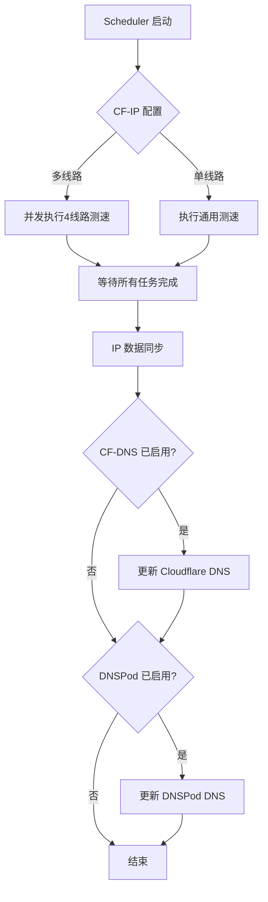

# Cloudflare-Best-IP-DnsUpdate

> **⚠️ 警告：本项目正在积极开发中，功能尚未稳定，代码结构可能随时发生重大变化。**
> 
> **强烈建议不要在生产环境中使用！仅供测试和技术交流。**

[](LICENSE)
[](https://www.gnu.org/software/bash/)
[]()

---

## 📖 项目简介

Cloudflare-Best-IP-DnsUpdate 是一款**全新重构**的自动化 Cloudflare IP 优选与 DNS 记录管理工具，采用现代化的 JSON 配置架构和模块化设计，实现从 IP 测速优选到 DNS 解析记录自动更新的**全链路自动化**。

### ✨ 核心特性

- **🚀 智能 IP 优选**：集成高性能 cfst 测速核心，支持分运营商（移动/联通/电信）专项优化
- **🔄 DNS 自动更新**：支持 Cloudflare 和 DNSPod 双平台，自动同步优选 IP 到 DNS 记录
- **⚙️ 全链路自动化**：内置调度中心，支持 Cron 定时任务，实现无人值守运行
- **🔒 安全完整性校验**：采用 SHA256 机制校验所有组件，确保下载与更新安全
- **📦 模块化设计**：清晰的功能划分，便于二次开发与维护
- **🎯 JSON 配置架构**：统一的 JSON 配置文件，替代传统 shell 变量，更易管理和扩展
- **💡 智能引导系统**：首次运行时自动引导用户完成配置，新手友好

---

## 🚀 快速开始

### 系统要求

- **操作系统**：Linux（Debian/Ubuntu/CentOS/Alpine 等主流发行版）
- **必要工具**：curl、bash、crontab、jq
- **权限要求**：root 或具有 sudo 权限的用户

### 一键安装（请勿使用，还在开发中，正在测试部署步骤......）

```bash
curl -sL https://raw.githubusercontent.com/Asunano/Cloudflare-Best-IP-DnsUpdate/main/cfopt.sh -o cfopt.sh && bash cfopt.sh
```

安装完成后，脚本会自动：
1. ✅ 迁移至标准目录（`/root/cfopt` 或 `$HOME/cfopt`）
2. ✅ 下载并配置所有核心组件
3. ✅ 创建全局命令（可在任意终端输入 `cfopt` 启动）
4. ✅ 初始化配置文件模板

### 启动程序

```bash
cfopt
```

首次运行时，系统会**智能引导**您完成各模块的配置。

---

## 🎯 功能模块

进入主菜单后，可选择以下功能：

| 选项 | 功能名称 | 说明 |
| :--- | :--- | :--- |
| **1** | **CF IP 优选管理** | 配置测速节点（Colo）、运行测速程序及管理测速定时任务 |
| **2** | **CF DNS 记录更新** | 将优选 IP 自动同步更新至 Cloudflare DNS 记录 |
| **3** | **DNSPod DNS 更新** | 腾讯云 DNSPod 分线路（ISP）解析管理与自动更新 |
| **4** | **自动化调度中心** | 一键触发全链路流程或设置后台 Cron 自动运行 |
| **5** | **检查组件更新** | 从远程仓库同步最新版本脚本及补丁 |
| **9** | **一键卸载** | 删除脚本及相关配置，清理所有数据 |

---

## 📁 项目架构

### 目录结构

```
$HOME/cfopt/
├── cfopt.sh                    # 主入口脚本（自动安装、归位及初始化）
├── version.txt                 # 远程版本索引（含版本号与 SHA256 校验值）
├── .gitignore                  # Git 忽略规则
│
├── conf/                       # 配置文件目录
│   ├── templates/              # 系统模板区（只读，首次安装时复制）
│   │   ├── cf-ip.json.example
│   │   ├── cf-dns.json.example
│   │   ├── dnspod.json.example
│   │   └── global.json.example
│   │
│   ├── cf-ip.json              # 用户配置区（可编辑）
│   ├── cf-dns.json
│   ├── dnspod.json
│   ├── global.json
│   └── status.conf             # 运行时自动生成
│
├── modules/                    # 核心功能模块
│   ├── cf-ip/                  # CF IP 测速模块
│   │   ├── core.sh             # 测速核心（非交互式，供调度器调用）
│   │   └── menu.sh             # 配置向导（交互式菜单）
│   │
│   ├── cf-dns/                 # Cloudflare DNS 更新模块
│   │   ├── core.sh             # DNS 更新核心
│   │   └── setup.sh            # 配置向导
│   │
│   ├── dnspod-dns/             # DNSPod DNS 更新模块
│   │   ├── core.sh             # DNS 更新核心
│   │   └── setup.sh            # 配置向导
│   │
│   ├── ip-sync/                # IP 数据同步模块
│   │   └── sync.sh             # 数据分发逻辑
│   │
│   └── scheduler/              # 自动化调度模块
│       └── run.sh              # 任务编排器
│
├── assets/                     # 资源文件
│   ├── cfst/                   # cfst 测速程序
│   └── data/                   # 运行时数据
│       ├── cf-ip/              # CF IP 测速结果
│       ├── cf-dns/             # CF DNS IP 列表
│       └── dnspod-dns/         # DNSPod IP 列表
│
└── logs/                       # 日志文件
    ├── cf-ip/
    ├── cf-dns/
    └── dnspod-dns/
```

### 架构优势

#### 1. **模板与配置分离**
- 📝 模板文件存放在 `conf/templates/`，作为参考示例
- ⚙️ 实际配置文件在 `conf/`，用户可自由编辑
- 🔄 更新组件时不会覆盖用户配置
- 💾 首次安装时自动从模板生成配置文件

#### 2. **JSON 统一配置**
- 📋 所有配置项采用标准 JSON 格式
- 🔧 使用 `jq` 工具进行配置读写，类型安全
- 🎯 支持嵌套结构和默认值
- 📊 易于验证和调试

#### 3. **模块化设计**
- 🧩 每个功能独立成模块，职责单一
- 🔌 通过标准化接口通信，松耦合
- 🛠️ 易于单独测试和维护
- 🚀 支持按需启用/禁用模块

#### 4. **智能引导系统**
- 💡 首次运行时自动检测配置状态
- 🎯 提供 Y/n 确认，一键启动配置向导
- 📚 清晰的配置项说明和默认值
- ✅ 实时验证输入格式

---

## ⚙️ 配置指南

### 配置文件说明

#### 1. CF IP 测速配置 (`conf/cf-ip.json`)

```json
{
  "cfst": {
    "directory": "/root/cfopt/assets/cfst",
    "threads": 200,
    "colo": "HKG,NRT,SIN",
    "ping_times": 4,
    "download_count": 10,
    "download_time": 10,
    "port": 443,
    "url": "https://cf-ns.com/cdn-cgi/trace"
  },
  "speed_test": {
    "take_ip_num": 5
  },
  "multi_line": {
    "enabled": false,
    "colo_mobile": "HKG,SIN,TYO,LON",
    "colo_unicom": "SJC,LAX,SIN,TYO",
    "colo_telecom": "SJC,LAX,TYO,SIN"
  }
}
```

**关键配置项：**
- `cfst.colo`: Cloudflare 数据中心节点列表
- `speed_test.take_ip_num`: 返回的最优 IP 数量
- `multi_line.enabled`: 是否启用多线路分流测速

#### 2. Cloudflare DNS 配置 (`conf/cf-dns.json`)

```json
{
  "enabled": true,
  "api": {
    "token": "your_api_token_here",
    "zone_id": "your_zone_id_here",
    "timeout": 10,
    "max_retries": 5
  },
  "dns": {
    "record_name": "www",
    "domain": "example.com",
    "max_ips_per_record": 2
  },
  "ip_source": {
    "file_path": "/root/cfopt/assets/data/cf-dns/ip_list.txt"
  }
}
```

**关键配置项：**
- `api.token`: Cloudflare API Token（需 Zone.DNS - Edit 权限）
- `api.zone_id`: 域名区域 ID
- `dns.record_name`: DNS 记录名称（如 www、@）
- `dns.max_ips_per_record`: 每条记录的最大 IP 数量

#### 3. DNSPod DNS 配置 (`conf/dnspod.json`)

```json
{
  "enabled": true,
  "api": {
    "id": "your_api_id_here",
    "token": "your_api_token_here",
    "timeout": 10,
    "max_retries": 5
  },
  "dns": {
    "domain": "example.com",
    "sub_domain": "www",
    "ttl": 600,
    "mode": "single",
    "max_ips_per_record": 2,
    "subdomain_strategy": "separate",
    "isp_lines": "默认 联通 移动 电信"
  },
  "ip_source": {
    "file_path": "/root/cfopt/assets/data/dnspod-dns/ip_list.txt",
    "files": {
      "default": "/root/cfopt/assets/data/dnspod-dns/default.txt",
      "unicom": "/root/cfopt/assets/data/dnspod-dns/unicom.txt",
      "mobile": "/root/cfopt/assets/data/dnspod-dns/mobile.txt",
      "telecom": "/root/cfopt/assets/data/dnspod-dns/telecom.txt"
    }
  }
}
```

**关键配置项：**
- `api.id/token`: DNSPod API 凭证
- `dns.mode`: 工作模式（`single` 单线路 / `multi` 多线路）
- `dns.subdomain_strategy`: 子域名策略（`separate` 分离 / `unified` 统一）
- `dns.isp_lines`: 运营商线路列表

### 获取 API 凭证

#### Cloudflare
1. 登录 [Cloudflare Dashboard](https://dash.cloudflare.com/)
2. 进入 **My Profile** → **API Tokens**
3. 点击 **Create Token**
4. 选择模板：**Edit zone DNS**
5. 在 **Zone Resources** 中选择您的域名
6. 点击 **Continue to summary** → **Create Token**
7. **复制生成的 Token**（只显示一次！）
8. 在域名概述页面查看 **Zone ID**

#### DNSPod（腾讯云）
1. 登录 [DNSPod 控制台](https://console.dnspod.cn/)
2. 进入 **账号中心** → **密钥管理**
3. 点击 **创建密钥**
4. 填写密钥名称（例如：cfopt）
5. **复制 ID 和 Token**（Token 只显示一次！）

> ⚠️ **注意**：请妥善保管 API 凭证，不要泄露给他人。建议定期更换。

---

## 🔄 工作流程

### 自动化调度流程



### 手动执行流程

1. **CF IP 测速**：运行 `modules/cf-ip/core.sh` 或使用菜单选项 1
2. **IP 数据同步**：自动执行，将测速结果分发到各 DNS 模块
3. **DNS 记录更新**：根据配置自动更新 Cloudflare 或 DNSPod 记录

---

## 🛠️ 高级用法

### 命令行直接调用

```bash
# 执行 CF IP 测速
bash /root/cfopt/modules/cf-ip/core.sh

# 更新 Cloudflare DNS
bash /root/cfopt/modules/cf-dns/core.sh

# 更新 DNSPod DNS
bash /root/cfopt/modules/dnspod-dns/core.sh

# 执行完整调度流程
bash /root/cfopt/modules/scheduler/run.sh
```

### 自定义定时任务

```bash
# 编辑 crontab
crontab -e

# 每 6 小时执行一次完整流程
0 */6 * * * bash /root/cfopt/modules/scheduler/run.sh >> /root/cfopt/logs/scheduler.log 2>&1

# 每天凌晨 2 点执行 CF IP 测速
0 2 * * * bash /root/cfopt/modules/cf-ip/core.sh >> /root/cfopt/logs/cf-ip.log 2>&1
```

---

## 🔧 故障排查

### 常见问题

#### 1. 配置文件不存在
```
错误: 找不到配置文件 /root/cfopt/conf/cf-dns.json
```
**解决方案**：运行 `cfopt` 进入菜单，选择对应模块进行配置。

#### 2. jq 未安装
```
错误: jq 未安装 (必需工具)
```
**解决方案**：
```bash
# Debian/Ubuntu
apt install -y jq

# CentOS/RHEL
yum install -y jq
```

#### 3. API Token 无效
```
错误: API 错误: AuthenticationError
```
**解决方案**：
- 检查 Token 是否正确复制（无多余空格）
- 确认 Token 权限包含 DNS 编辑
- 检查 Zone ID 是否正确

#### 4. IP 文件为空
```
错误: IP 文件格式错误或包含无效数据
```
**解决方案**：
- 先运行 CF IP 测速程序生成 IP 列表
- 检查测速结果文件是否存在
- 确认 IP 文件格式正确

### 日志查看

```bash
# 查看 CF IP 测速日志
tail -f /root/cfopt/logs/cf-ip/*.log

# 查看 Cloudflare DNS 更新日志
tail -f /root/cfopt/logs/cf-dns/*.log

# 查看 DNSPod DNS 更新日志
tail -f /root/cfopt/logs/dnspod-dns/*.log
```

---

## 🎨 主要改进（相比旧版本）

### 架构层面
- ✅ **JSON 配置架构**：替代传统 shell 变量，类型安全，易扩展
- ✅ **模板与配置分离**：更新不覆盖用户配置，支持配置恢复
- ✅ **模块化重构**：清晰的职责划分，core.sh（非交互式）+ menu/setup.sh（交互式）
- ✅ **统一路径规范**：所有配置文件集中在 `conf/` 目录

### 功能层面
- ✅ **智能引导系统**：首次运行自动检测配置状态，Y/n 确认启动向导
- ✅ **多线路支持**：DNSPod 支持单线路和多线路（运营商分流）模式
- ✅ **进程锁管理**：防止并发执行导致的数据冲突
- ✅ **数据有效性校验**：启动前检查 IP 文件格式和内容

### 安全性
- ✅ **SHA256 校验**：所有组件下载后验证完整性
- ✅ **文件权限控制**：配置文件统一设置为 600
- ✅ **API Token 保护**：不在日志中显示完整 Token

---

## 👥 开发与贡献

### 开发状态

本项目目前处于**积极开发阶段**，存在以下特点：
- 🔄 功能可能随时调整或重构
- 📝 API 接口和配置文件格式可能发生变化
- ⚠️ 不建议用于生产环境或关键业务

### 贡献方式

欢迎通过以下方式参与项目：
- 🐛 提交 [Issue](https://github.com/Asunano/Cloudflare-Best-IP-DnsUpdate/issues) 报告 Bug 或提出建议
- 💻 提交 [Pull Request](https://github.com/Asunano/Cloudflare-Best-IP-DnsUpdate/pulls) 贡献代码
- 📖 完善文档或提供使用反馈
- 🌟 Star 项目支持我们

### 开发规范

- 遵循 ShellCheck 规范
- 使用中文注释
- 保持代码简洁（KISS 原则）
- 所有配置使用 JSON 格式
- 添加适当的错误处理

---

## 📜 许可证与致谢

### 开源协议

本项目基于 **GPL-3.0 License** 开源。

### 特别致谢

本项目的开发得益于以下优秀开源项目：

1. **[XIU2/CloudflareSpeedTest](https://github.com/XIU2/CloudflareSpeedTest)**
   - 核心测速功能依赖该项目提供的测速程序
   - 向原作者表示诚挚感谢

2. **[ZhiXuanWang/cf-speed-dns](https://github.com/ZhiXuanWang/cf-speed-dns)**
   - Cloudflare 与 DNSPod DNS 更新模块基于该项目的 Python 脚本逻辑改写
   - 感谢原作者的分享与贡献

本项目在上述优秀工作的基础上，专注于**自动化调度**、**IP 数据处理**、**模块化封装**及**多平台兼容性**的扩展。

---

## ⚖️ 免责声明

**本项目仅供学习和技术研究使用，使用本工具产生的任何后果由使用者自行承担。**

- ⚠️ 请遵守当地法律法规，不得用于任何违法违规用途
- ⚠️ 使用前请仔细阅读 Cloudflare 和 DNSPod 的服务条款
- ⚠️ 频繁更新 DNS 记录可能触发平台的风控机制，请合理设置更新频率
- ⚠️ 作者不对因使用本工具导致的任何损失或损害负责

---

**最后更新**: 2026-05-01  
**版本**: 开发中  
**仓库**: https://github.com/Asunano/Cloudflare-Best-IP-DnsUpdate
