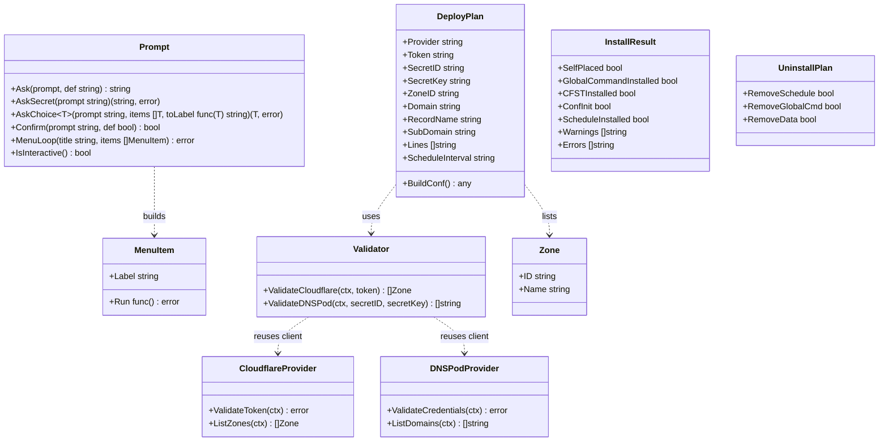
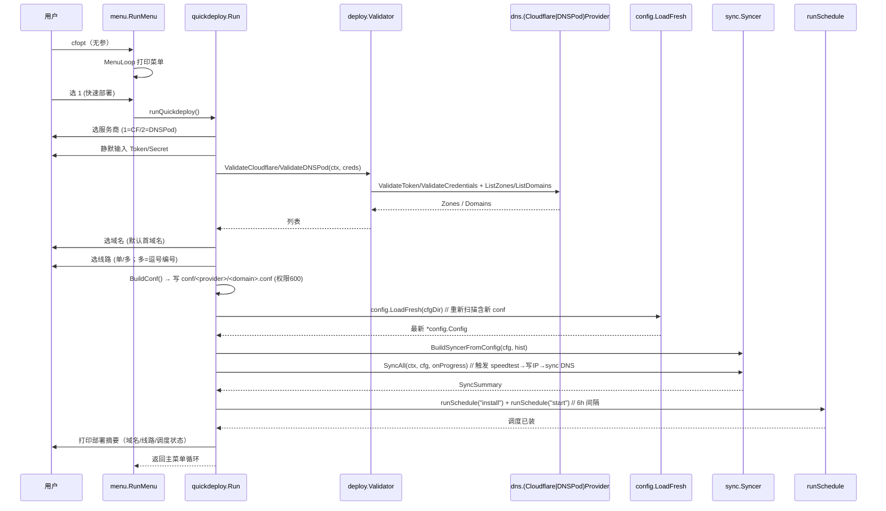
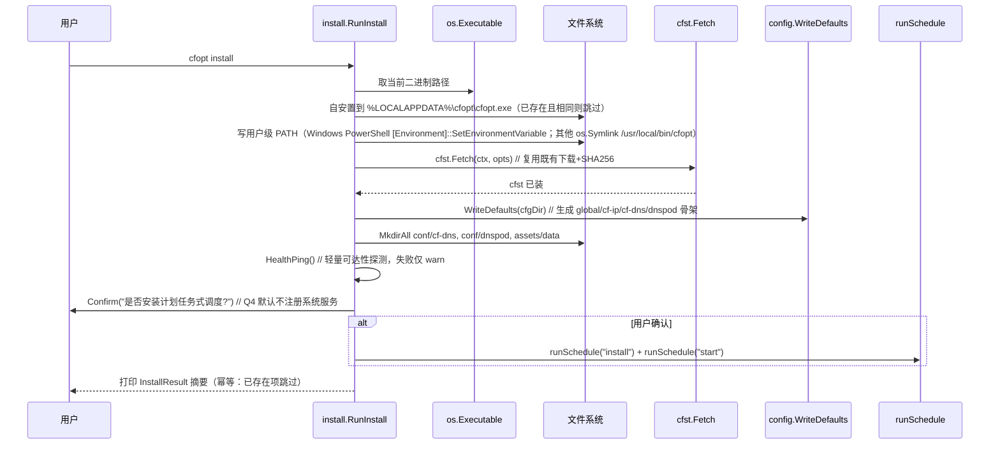
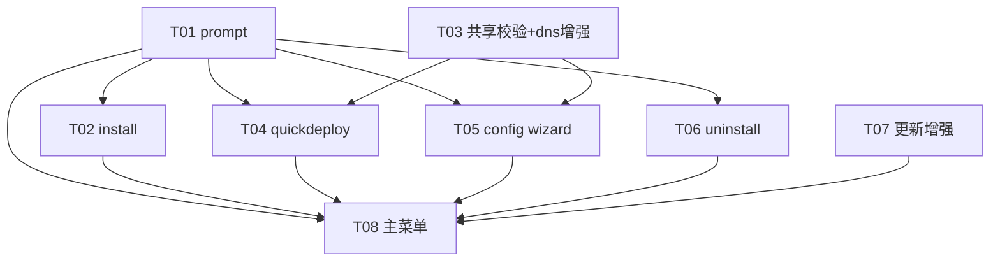

# 系统设计文档（增量）：cfopt-go 安装流程 / 主菜单 / 快速部署

- **文档版本**：v1.0
- **日期**：2026-07-17
- **作者**：高见远（软件架构师）
- **项目**：cfopt-go（Go 重写版 cfopt，Cobra CLI + kardianos/service + IPC 对接 Tauri/Rust/前端）
- **语言**：简体中文
- **性质**：增量设计 + 任务分解（仅产出设计文档，不改动任何业务代码；改动点交由工程师实现）
- **配套图**：`docs/class-diagram.mermaid`、`docs/sequence-diagram.mermaid`

---

## 0. 范围与边界（对齐 PRD）

- **形态**：终端问答菜单（`cfopt` 无参即进主菜单循环），**不引入 bubbletea 等 TUI 库**。
- **MVP 闭环**：`install` + 主菜单 + `quickdeploy`（单域名，支持单/多线路）+ 自更新增强 + 卸载。
- **硬约束**：
  - 不用 git；不兼容旧 Bash 版；**不改 IPC / Tauri GUI 既有行为**（终端菜单/向导与 GUI 并存互不干扰）。
  - 沙箱只编 Go，不碰 Rust/Node。
  - 用户运行环境 Windows + cmd/PowerShell，**禁用 bash 专属语法**（`$(...)`/`printf`/管道 `nc` 等）；生成的脚本/命令必须用跨平台 Go 代码（`os/exec` 调 PowerShell/`setx`）实现。
  - 复用既有 `cfopt cfst fetch` 与 `cfopt update`，不推翻重写。
- **已拍板决策（Q1–Q4）**：
  - **Q1** Windows 全局命令：`%LOCALAPPDATA%\cfopt\` 自安置 + 写用户级 PATH（非 Windows 用 `/usr/local/bin` 软链），幂等。
  - **Q2** quickdeploy 默认调度频率：每 **6 小时**（对齐 `global.schedule.interval = "6h"`）。
  - **Q3** 多线路输入：逗号分隔编号（如 `1,3,5`），空=单线路默认。
  - **Q4** `install` 默认不注册系统服务，仅提供「装计划任务式调度」选项。

---

## 1. 实现方案 + 框架选型

### 1.1 终端菜单/向导：自研 `internal/prompt` 轻量包

- **只用 Go 标准库**（`bufio` / `fmt` / `os` / `strings`），**不引入任何第三方 TUI 框架**。
- 提供一组**纯函数、可单元测试**的问答原语，所有交互命令（install/uninstall/menu/quickdeploy/config wizard）共用：
  - `Ask(prompt string, def string) string`：单行输入，回车取默认。
  - `AskSecret(prompt string) (string, error)`：静默输入（不回显），用 `golang.org/x/term` 的 `ReadPassword`；为避免新增依赖，**降级方案**用 `os.Stdin` 直接读（不回显依赖终端 raw mode，Windows 上用 `golang.org/x/term` 最稳）。**结论：引入 `golang.org/x/term`（标准官方扩展，非 TUI 框架）用于 `AskSecret` 静默输入**——这不属于被禁止的 TUI 库，且是 Go 密码输入的惯用做法；若严格零新增依赖则退化为明文读（仅在 CI/非交互下）。
  - `AskChoice[T any](prompt string, items []T, toLabel func(T) string) (T, error)`：打印编号列表，输入编号选中（用于选服务商、选域名/Zone、选线路）。
  - `Confirm(prompt string, def bool) bool`：y/N 确认。
  - `MenuLoop(title string, items []MenuItem, onSelect func(int) error)`：打印数字菜单循环，输入 `0` 退出；非交互终端（非 TTY）时返回错误并交由上层打印用法。
  - `IsInteractive() bool`：复用 `cmd/config.go` 已有的 `isInteractive()` 逻辑（检测 `os.Stdout` 是否为字符设备）。
- **不依赖 Cobra 的交互能力**（Cobra 只管子命令解析），菜单/向导由 `internal/prompt` 驱动 `os.Stdin`。

### 1.2 各命令职责边界

| 命令 | 职责 | 是否新增 | 复用 |
|---|---|---|---|
| `cfopt install` | 自安置二进制 + 全局命令 + 触发 cfst fetch + 生成 conf 骨架 + 轻量网络体检（幂等）+ 可选装计划任务调度 | 新增 `cmd/install.go` + `internal/install` | `cfst.Fetch`、`config.WriteDefaults`、`runSchedule` |
| `cfopt`（无参） | 进入主菜单循环（快速部署/配置向导/调度中心/检查更新/卸载） | 新增 `cmd/menu.go` + 改 `cmd/root.go` 挂 `RunE` | 各子命令函数 |
| `cfopt quickdeploy` | 单域名（单/多线路）向导：静默 Token → API 校验 → 取 Zone/域名 → 生成 600 conf → speedtest → sync → 装调度 → 摘要 | 新增 `cmd/quickdeploy.go` + `internal/deploy/validate.go` | `internal/dns` 客户端、`sync.BuildSyncerFromConfig`/`SyncAll`、`runSchedule` |
| `cfopt config wizard` | 重写为真问答式配置生成（与 quickdeploy 共享校验） | 改 `cmd/config.go` 的 `runWizard` | `internal/deploy/validate.go` |
| `cfopt uninstall` | 交互确认后清理全局命令/调度/目录（保留/全清选项） | 新增 `cmd/uninstall.go` | `runSchedule("uninstall")`、`os.Remove` |
| `cfopt update --check`（增强） | 复用现有 `--check`，主菜单「检查更新」展示版本差 + 变更说明 | 改 `cmd/update.go`（展示层）+ 可选 `internal/update` 暴露 release notes | `update.Updater.Check` |

### 1.3 架构模式

- **命令层（cmd）**：Cobra 子命令，薄编排，调用 `internal/*` 领域逻辑。
- **领域层（internal）**：`internal/prompt`（交互原语）、`internal/install`（自安置）、`internal/deploy`（共享校验/部署编排）。
- **既有能力（internal/dns, internal/sync, internal/speedtest, internal/cfst, internal/update, internal/scheduler）**：零改动或最小增强（仅给 `internal/dns` 增加 Token 校验/列 Zone/列域名入口）。

---

## 2. 文件列表（新增 / 修改，相对路径）

> 根目录基准：`cfopt-go/`。以下路径均相对该根目录。

### 2.1 新增文件

| 路径 | 作用 | 关联任务 |
|---|---|---|
| `internal/prompt/prompt.go` | 问答/菜单原语（ask/askSecret/askChoice/confirm/menuLoop/isInteractive），可单元测试 | T01 |
| `internal/prompt/prompt_test.go` | `internal/prompt` 单元测试（用 `strings.Reader` 模拟 stdin） | T01 |
| `internal/install/install.go` | 自安置 + 全局命令 + conf 骨架 + 网络体检核心逻辑；`InstallResult`、`SelfPlace`、`SetupGlobalCommand`、`Provision`、`HealthPing` | T02 |
| `cmd/install.go` | `cfopt install` Cobra 命令，编排 `internal/install` | T02 |
| `cmd/install_test.go` | install 幂等/自安置单元测试（用临时目录） | T02 |
| `internal/deploy/validate.go` | **共享校验层**：`ValidateCredentials(provider, token/secret) error` + `ListZones`/`ListDomains` 封装；`Zone{ID,Name}`、`DomainInfo{Name}` 类型 | T03 |
| `internal/deploy/validate_test.go` | 校验层单测（用 `httptest` 注入 base URL） | T03 |
| `cmd/quickdeploy.go` | `cfopt quickdeploy` 向导；`DeployPlan` 结构；编排「校验→落盘→sync→调度」 | T04 |
| `cmd/quickdeploy_test.go` | quickdeploy 单线路/多线路落盘 + 调用链 mock 测试 | T04 |
| `cmd/uninstall.go` | `cfopt uninstall` 交互清理；`UninstallPlan` 结构 | T06 |
| `cmd/uninstall_test.go` | uninstall 保留/全清分支测试 | T06 |
| `cmd/menu.go` | `cfopt` 无参主菜单循环 + 调度中心 + 检查更新菜单项 | T08 |
| `cmd/menu_test.go` | 菜单路由（注入 fake stdin）测试 | T08 |

### 2.2 修改文件

| 路径 | 改动点 | 关联任务 |
|---|---|---|
| `cmd/root.go` | 给 `rootCmd` 增加 `RunE` 调用 `runMenu()`；`init()` 注册新命令（install/quickdeploy/uninstall）；非交互时打印用法退出 | T02/T04/T06/T08 |
| `cmd/config.go` | 重写 `runWizard` 为真问答式；新增 `runWizardForProvider`（CF/DNSPod 分支）；复用 `internal/deploy/validate.go`；删除旧的空壳提示 | T05 |
| `cmd/update.go` | 增强「检查更新」展示：在 `--check` 或新 `cfopt update info` 中输出当前/最新版本差与变更说明（复用 `updater.Check` 已返回的 `ReleaseInfo`，可选扩展 `Body` 字段） | T07 |
| `internal/dns/cloudflare.go` | **最小增强**：新增 `NewCloudflareProviderWithToken(token)`、`ValidateToken(ctx)`、`ListZones(ctx) ([]Zone, error)`；复用 `cloudflareBaseURL`/`client.DoRequest` | T03 |
| `internal/dns/dnspod.go` | **最小增强**：新增 `NewDNSPodProviderWithCredentials(secretID, secretKey)`、`ValidateCredentials(ctx)`、`ListDomains(ctx) ([]string, error)`；复用 `dnspodBaseURL`/`sign`/`call` | T03 |
| `internal/update/updater.go` | **可选增强**：`ReleaseInfo` 增加 `Notes string`（解析 JSON `body`），供检查更新展示变更说明（不改动 `DownloadAndReplace` 原子替换逻辑） | T07 |

> 说明：`internal/dns` 与 `internal/update` 仅做**最小、向后兼容**的入口增强，既有 `Sync`/`DownloadAndReplace` 逻辑完全不动。

---

## 3. 数据结构和接口（类图 / 结构）

### 3.1 `internal/prompt` 公开函数签名

```go
package prompt

// MenuItem 菜单项
type MenuItem struct {
    Label string            // 显示文案
    Run   func() error      // 选中后执行
}

// Ask 单行输入，回车取 def。
func Ask(prompt, def string) string

// AskSecret 静默输入（不回显），返回明文。非 TTY 时退化为普通读。
func AskSecret(prompt string) (string, error)

// AskChoice 编号选择；items 为空返回错误。toLabel 决定展示文案。
func AskChoice[T any](prompt string, items []T, toLabel func(T) string) (T, error)

// Confirm y/N 确认，def 为默认（回车采用）。
func Confirm(prompt string, def bool) bool

// MenuLoop 打印数字菜单并循环；选 0 退出；非交互返回 ErrNotInteractive。
func MenuLoop(title string, items []MenuItem) error

// IsInteractive 标准输出是否为字符设备（TTY）。
func IsInteractive() bool

// ErrNotInteractive 非交互终端错误。
var ErrNotInteractive = errors.New("prompt: not interactive")
```

### 3.2 部署/安装领域结构

```go
// internal/deploy —— 共享校验层
package deploy

// Zone Cloudflare 可用 Zone。
type Zone struct {
    ID   string // Zone ID
    Name string // 域名（root domain）
}

// ValidateCloudflare 校验 CF Token 并取回 Zone 列表（空 token 直接报错）。
func ValidateCloudflare(ctx context.Context, token string) ([]Zone, error)

// ValidateDNSPod 校验 DNSPod 凭证并取回域名列表（凭证错误明确返回）。
func ValidateDNSPod(ctx context.Context, secretID, secretKey string) ([]string, error)

// DeployPlan quickdeploy / config wizard 的收集结果。
type DeployPlan struct {
    Provider          string   // "cloudflare" | "dnspod"
    Token             string   // CF: API Token；DNSPod 留空
    SecretID          string   // DNSPod 专用
    SecretKey         string   // DNSPod 专用
    ZoneID            string   // CF Zone ID
    Domain            string   // 域名（root domain）
    RecordName        string   // CF 子域名（如 www / @）；DNSPod 用 SubDomain
    SubDomain         string   // DNSPod 子域名
    Lines             []string // DNSPod 多线路线路名（默认/联通/移动/电信）；CF 为空=单记录
    ScheduleInterval  string   // 调度间隔，默认 "6h"
}

// BuildConf 把 DeployPlan 转为可被 loader 扫描的 conf 结构（CF→*config.CFDNSConfig，DNSPod→*config.DNSPodConfig）。
func (p *DeployPlan) BuildConf() (any, error)

// internal/install —— 自安置
package install

// InstallResult 自安置结果汇总。
type InstallResult struct {
    SelfPlaced             bool     // 二进制已自安置到目标目录
    GlobalCommandInstalled bool    // 全局命令已安装（PATH/软链）
    CFSTInstalled         bool     // cfst 已下载安装
    ConfInit              bool     // conf 骨架已生成
    ScheduleInstalled     bool     // 计划任务调度已安装
    Warnings              []string // 非致命告警（如网络体检失败）
    Errors                []string // 致命错误
}

// RunInstall 一键自安置（幂等）。dir 为目标安置目录（默认 %LOCALAPPDATA%\cfopt 或 /usr/local/bin）。
func RunInstall(ctx context.Context, dir, cfgDir string, withSchedule bool) (*InstallResult, error)

// UninstallPlan 卸载计划。
type UninstallPlan struct {
    RemoveSchedule   bool // 停止并卸载调度
    RemoveGlobalCmd  bool // 移除全局命令（PATH 项/软链）
    RemoveData       bool // 全清（含 conf/数据目录）；false=保留配置
}
```

### 3.3 类图（Mermaid）



---

## 4. 程序调用流程（时序图）

### 4.1 `cfopt` 无参 → 主菜单 → quickdeploy 闭环



### 4.2 `cfopt install` 自安置时序



---

## 5. 任务列表（有序、含依赖、按实现顺序）

> 优先级：P0=Must（MVP 必须）、P1=Should（增强）、P2=Nice to have。
> 实现顺序即下表自顶向下；每个任务至少含 3 个相关文件，可独立编译验证。

### T01 【P0】`internal/prompt` 基础问答/菜单原语包
- **源文件**：`internal/prompt/prompt.go`、`internal/prompt/prompt_test.go`
- **依赖**：无
- **交付**：`ask/askSecret/askChoice/confirm/menuLoop/isInteractive` 全部用标准库实现并通过单测（`strings.Reader` 模拟 stdin）。
- **前置**：所有后续交互命令的基础。

### T02 【P0】`cfopt install` 自安置 + 全局命令 + cfst fetch + conf 骨架 + 网络体检（幂等）
- **源文件**：`cmd/install.go`、`internal/install/install.go`、`cmd/install_test.go`
- **依赖**：T01
- **交付**：`RunInstall` 完成自安置（`%LOCALAPPDATA%\cfopt` 或 `/usr/local/bin`）、写用户级 PATH（跨平台分支 `installGlobalCommand`）、触发 `cfst.Fetch`、生成 conf 骨架、轻量网络体检；提供「装计划任务式调度」选项（默认 N，Q4）。幂等：已安置/已存在配置跳过。
- **复用**：`cfst.Fetch`、`config.WriteDefaults`、`runSchedule`（来自 `schedule.go`）。

### T03 【P0】共享校验层 `internal/deploy/validate.go` + `internal/dns` 校验入口最小增强
- **源文件**：`internal/deploy/validate.go`、`internal/deploy/validate_test.go`、`internal/dns/cloudflare.go`（增方法）、`internal/dns/dnspod.go`（增方法）
- **依赖**：无（仅依赖既有 `internal/dns` 客户端与 `config` 类型）
- **交付**：
  - `internal/dns/cloudflare.go` 新增 `NewCloudflareProviderWithToken(token)`、`ValidateToken(ctx)`（调 `GET /user/tokens/verify`，复用 `cloudflareBaseURL`+`client.DoRequest`）、`ListZones(ctx) ([]Zone, error)`（调 `GET /zones?status=active&per_page=50`）。
  - `internal/dns/dnspod.go` 新增 `NewDNSPodProviderWithCredentials(secretID, secretKey)`、`ValidateCredentials(ctx)`（调 `DescribeDomainList` 校验，复用 `sign`+`call`）、`ListDomains(ctx) ([]string, error)`。
  - `internal/deploy/validate.go` 暴露 `ValidateCloudflare` / `ValidateDNSPod` 给 quickdeploy 与 config wizard **共用**。
- **关键**：既有 `Sync`/`call`/`sign` 逻辑零改动，仅新增方法。

### T04 【P0】`cfopt quickdeploy` 单域名向导（CF/DNSPod，单/多线路）
- **源文件**：`cmd/quickdeploy.go`、`cmd/quickdeploy_test.go`
- **依赖**：T01、T03
- **交付**：`DeployPlan` 收集 → `deploy.ValidateCloudflare/DNSPod` 校验取 Zone/域名 → `BuildConf()` 落盘 `conf/cf-dns/<domain>.conf` 或 `conf/dnspod/<domain>.conf`（权限 600）→ `config.LoadFresh` → `sync.BuildSyncerFromConfig`+`SyncAll`（speedtest→sync）→ `runSchedule("install")+("start")`（6h）→ 打印摘要。多线路输入按 Q3（逗号编号）。
- **复用**：`internal/deploy`、`internal/sync`、`internal/dns`（T03 增强）、`runSchedule`。

### T05 【P0】重写 `cfopt config wizard` 为真问答式配置生成
- **源文件**：`cmd/config.go`（重写 `runWizard` + 新增 `runWizardForProvider`）、`cmd/config_test.go`
- **依赖**：T01、T03
- **交付**：选服务商 → 静默凭证 → `deploy` 校验取 Zone/域名 → 选线路（单/多）→ 真写入 conf（非空壳）；非交互终端保留降级提示。与 quickdeploy **共享 `internal/deploy` 校验**。
- **复用**：`internal/deploy/validate.go`、`config.WriteDefaults` 模板语义。

### T06 【P0】`cfopt uninstall` 交互确认清理（保留/全清）
- **源文件**：`cmd/uninstall.go`、`cmd/uninstall_test.go`
- **依赖**：T01
- **交付**：`UninstallPlan`：默认不清理（防误删）→ `Confirm` → 停止并卸载调度（`runSchedule("uninstall")`）→ 移除全局命令（PATH 项/软链）→ 可选全清 conf/数据目录（保留配置为默认）→ 打印已移除清单；失败项明确列出不静默跳过。

### T07 【P1】自更新增强：检查更新展示 + 变更说明（复用现有 `update --check`）
- **源文件**：`cmd/update.go`（展示层增强）、`cmd/update_test.go`、（可选）`internal/update/updater.go`（`ReleaseInfo` 增 `Notes`）
- **依赖**：无（`cfopt update --check` 已存在并能返回退出码 2）
- **交付**：主菜单「检查更新」调用 `up.Check` 展示当前/最新版本差；可选从 release `body` 解析变更说明（扩展 `ReleaseInfo.Notes`，**不碰** `DownloadAndReplace` 原子替换）。更新过程复用既有原子替换 + 回滚提示。

### T08 【P0/P1】`cfopt` 无参主菜单循环 + 调度中心 + 端到端测试
- **源文件**：`cmd/menu.go`、`cmd/root.go`（挂 `rootCmd.RunE=runMenu` + 注册新命令）、`cmd/menu_test.go`
- **依赖**：T01、T02、T04、T05、T06、T07
- **交付**：
  - 主菜单（无参即进）：1 快速部署 / 2 配置向导 / 3 调度中心（包装 `runSchedule` install/start/stop/status/uninstall）/ 4 检查更新（T07）/ 9 卸载 / 0 退出；循环返回。
  - 非交互终端：打印菜单+用法即退出（不阻塞）。
  - 调度中心子菜单复用 `runSchedule*` 系列。
  - 整合端到端：用临时 `cfgDir` 跑 install→quickdeploy→uninstall 冒烟脚本（`scripts/e2e_install_smoke_test.go` 或 `cmd/menu_test.go` 内集成）。
- **注意**：PRD 主菜单项 5（健康检测 `doctor`，P2）**不在本 MVP 闭环内**，菜单可预留占位入口，实现延后（见 §8）。

### 依赖关系图（Mermaid）



---

## 6. 依赖包列表

**仅 Go 标准库 + 项目已有依赖，无新第三方 TUI/CLI 依赖。**

| 包 | 用途 | 来源 |
|---|---|---|
| `bufio` / `fmt` / `os` / `strings` / `path/filepath` / `runtime` / `context` / `net` / `time` | 问答/文件/网络/跨平台 | 标准库 |
| `golang.org/x/term` | `AskSecret` 静默密码输入（Windows 稳）；若严格零新增则退化为明文读 | 标准官方扩展（唯一新增，非 TUI 框架） |
| `github.com/spf13/cobra` | 子命令解析（既有） | 已有 |
| `github.com/kardianos/service` | 调度/系统服务（经 `internal/scheduler`，既有） | 已有 |
| `github.com/cenkalti/backoff/v4` | HTTP 重试（经 `internal/dns`，既有） | 已有 |
| `github.com/blang/semver` | 版本比较（经 `internal/update`，既有） | 已有 |

> 说明：team-lead 提到「Go 1.26.x」，本仓库 `go.mod` 当前声明 `go 1.22`，工程师实现时按需对齐工具链版本（不影响本设计）。

---

## 7. 共享知识（跨文件约定）

1. **conf 生成统一用 `config` 包类型 + `json.MarshalIndent`**：生成的 `conf/cf-dns/<domain>.conf` 与 `conf/dnspod/<domain>.conf` 内容分别为 `*config.CFDNSConfig` / `*config.DNSPodConfig` 的 JSON（带 2 空格缩进），**文件权限统一 0600**。文件名=域名（与 `loader.scanDNSPodConfDir` / `scanCFDNSConfDir` 扫描规则一致：key 取文件名去 `.conf`）。
2. **全局命令安装跨平台抽象**：`internal/install` 内一个 `installGlobalCommand(goos string) error` 按 `runtime.GOOS` 分支——Windows 用 `powershell -Command [Environment]::SetEnvironmentVariable("Path", ..., "User")` 写用户 PATH（幂等：已含则跳过）；其他用 `os.Symlink(exe, /usr/local/bin/cfopt)`。禁止任何 bash 专属语法。
3. **调度安装统一走 `cfopt schedule install`**：quickdeploy / install / 主菜单调度中心**全部复用** `cmd/schedule.go` 的 `runSchedule("install"|"start"|"stop"|"status"|"uninstall")`，**不重复 daemon 逻辑**。
4. **进程内写完 conf 必须 `config.LoadFresh`**：`config.Load` 用 `sync.Once` 缓存，向导/quickdeploy 在同一进程写入新 conf 后，须用 `config.LoadFresh(cfgDir)` 重新扫描（含新 `.conf`）再交给 `sync.BuildSyncerFromConfig`，否则新域名不会被同步。
5. **默认调度间隔 6h**：`global.json` 的 `schedule.interval` 模板已为 `"6h"`（见 `config/template.go`）；quickdeploy 的 `DeployPlan.ScheduleInterval` 默认 `"6h"`（Q2）。
6. **静默输入失败可重试**：Token/Secret 校验失败（`deploy` 返回认证错误）时，向导/quickdeploy 应允许重新输入（最多 3 次），不直接退出。
7. **网络体检不阻塞**：`install` 的 `HealthPing` 仅做 TCP/HTTP 可达性探测（短超时），失败仅追加 `Warnings`，不影响安装成功。
8. **不改 IPC/GUI**：所有新增命令与交互逻辑只在终端侧；`cmd/serve.go`、`pkg/ipc`、Tauri/Rust 侧零改动，GUI 仍走单值配置。

---

## 8. 待明确事项（不阻塞 MVP）

| 编号 | 事项 | 影响 | 处理建议 |
|---|---|---|---|
| O1 | 健康检测 `cfopt doctor`（P2）是否纳入本次？ | 主菜单项 5 | **本增量不纳入 MVP 闭环**，菜单预留占位，实现延后。 |
| O2 | `golang.org/x/term` 是否可接受为唯一新增依赖？ | `AskSecret` 静默输入体验 | 默认接受（官方扩展，非 TUI 框架）；若严格零新增则退化为明文读（仅影响交互体验，不阻塞）。 |
| O3 | DNSPod 多线路「线路名」枚举来源？ | quickdeploy 多线路映射 | 采用模板固定枚举 `默认/联通/移动/电信`（与 `dnspod.json` 模板一致）；用户逗号编号 `1,3,5` 映射到该枚举。 |
| O4 | Cloudflare 的「多线路」语义？ | quickdeploy CF 多线路 | CF 配置模型为单 `record_name`，故 CF quickdeploy 仅支持单记录（`@` 或子域）；「多线路」能力主要落在 DNSPod `isp_lines`。如需 CF 多子域，留待后续。 |
| O5 | `install` 的「装计划任务式调度」默认是否开启？ | Q4 | 默认**不开启**（仅提供选项，用户确认才装）；系统服务注册不在 MVP。 |

> Q1–Q4 已拍板，不在待明确范围；上述 O1–O5 均不阻塞 MVP 实现。

---

## 9. 关键复用点速查（给工程师）

| 需实现能力 | 复用对象 | 最小改动方式 |
|---|---|---|
| Token/凭证校验 + 取 Zone/域名 | `internal/dns/cloudflare.go`、`dnspod.go` 既有 HTTP 客户端 | 新增 `ValidateToken`/`ValidateCredentials` + `ListZones`/`ListDomains` 方法（复用 `client.DoRequest`、`cloudflareBaseURL`/`dnspodBaseURL`、`sign`） |
| 共享校验（wizard 与 quickdeploy 共用） | 新建 `internal/deploy/validate.go` | 包一层 `ValidateCloudflare`/`ValidateDNSPod`，两命令都调它 |
| 下载 cfst 二进制 | `internal/cfst.Fetch` | 直接调用，`install`/`quickdeploy` 不重写 |
| 原子自更新 | `internal/update.Updater.DownloadAndReplace` | 仅增强展示层，不动替换逻辑 |
| 首次测速 + 同步 | `internal/sync.BuildSyncerFromConfig` + `Syncer.SyncAll` | 写完 conf 后用 `config.LoadFresh` 再构建 |
| 注册/启停调度 | `cmd/schedule.go` 的 `runSchedule` | 直接调用，不重复 daemon |
| 配置落盘/骨架 | `internal/config.WriteDefaults` / `TemplateContent` / `json.MarshalIndent`（权限 600） | 复用模板与类型 |
| 全局命令/自安置 | 新建 `internal/install` | 跨平台分支，复用 `os.Executable`/`os.Symlink`/PowerShell |
| 多域名扫描 | `internal/config.loader.scanDNSPodConfDir`/`scanCFDNSConfDir` | conf 文件名=域名，天然兼容 |
| 非交互检测 | `cmd/config.go` 既有 `isInteractive()` | 抽到 `internal/prompt.IsInteractive` 共用 |

---

## 10. 验收对照（MVP 闭环）

- [x] `cfopt`（无参）→ 主菜单可循环进入（T08）。
- [x] `cfopt install` 一条命令完成自安置 + 全局命令 + cfst 下载 + conf 骨架，幂等（T02）。
- [x] `cfopt quickdeploy` 单域名（单/多线路）向导，静默 Token → 自动校验取 Zone/域名 → 落盘 600 conf → speedtest → sync → 调度，全程无需手敲（T04）。
- [x] `cfopt config wizard` 真正写入配置（非空壳），且 `config validate` 通过（T05）。
- [x] `cfopt uninstall` 交互确认后干净清理，零残留（T06）。
- [x] IPC / Tauri GUI 既有行为未被改动；无 bash 专属语法；未触碰 Rust/Node（全程遵循）。
