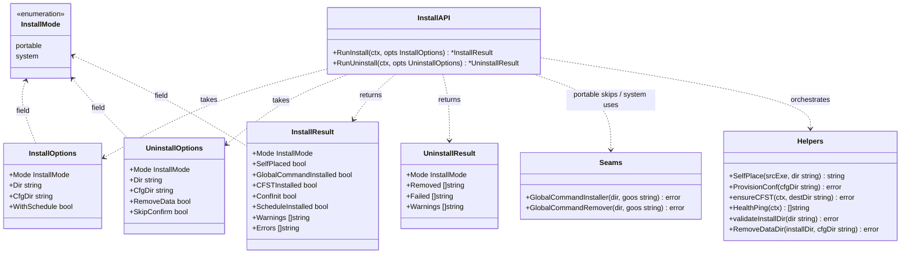
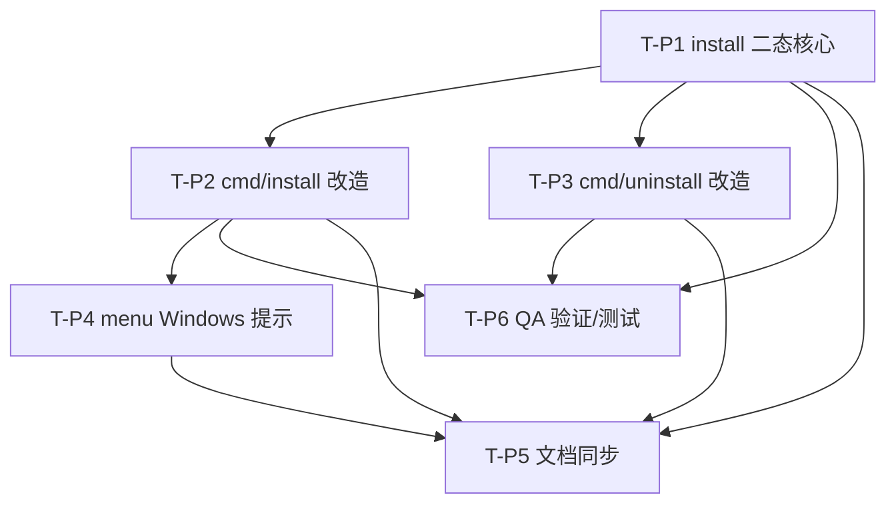

# 增量系统设计：cfopt-go 便携优先安装 / 系统级可选 / Windows GUI 推荐 / 文档同步

- **文档版本**：v1.0（增量设计，仅产出设计文档，不改动任何业务代码；改动点交由工程师实现）
- **日期**：2026-07-17
- **作者**：高见远（软件架构师）
- **项目**：cfopt-go（Go 重写版 cfopt；CLI = Cobra，GUI = Tauri v2 包装 Go sidecar）
- **语言**：简体中文
- **配套输入**：增量 PRD `docs/prd-portable-install-2026-07-17.md`、Phase B 设计 `docs/design-installer-quickdeploy-2026-07-17.md`
- **配套图**：`docs/portable-class-diagram.mermaid`、`docs/portable-sequence-diagram.mermaid`
- **性质**：本次**只改 Go 侧 CLI**；GUI 向导为前端后续项，本设计仅在 CLI 侧产出 Windows GUI 推荐提示文案。

---

## 0. 核心设计决策（TL;DR，供主理人速览）

| 编号 | 决策 | 理由 |
|---|---|---|
| D1 | 引入 `InstallMode` 枚举（`portable` / `system`），`RunInstall` / `RunUninstall` 改为接收 `InstallOptions` / `UninstallOptions` 结构体（取代旧的 `RunInstall(ctx, dir, cfgDir, withSchedule)` 四参签名）。 | 避免签名频繁改动；二态逻辑内聚在 `internal/install`。 |
| D2 | **便携模式跳过 `GlobalCommandInstaller` 与 `SelfPlace`（当目标目录==当前二进制目录时）**；cfst 下载目标改为 `filepath.Join(dir, "assets", "cfst")`。系统模式保持 Phase B 旧行为。 | 直击 Q0/Q1：便携零系统痕迹、删目录即干净。 |
| D3 | **`internal/install` 不调用 `runSchedule`、不 `import cmd`（铁律）**。调度注册/卸载一律由 `cmd` 层在 `--system` 时调用；便携模式根本不触碰调度。 | 保持 Phase B 边界。 |
| D4 | 便携模式 `cfgDir = filepath.Join(dir, "conf")`（**非字面 `dir`**）。 | 使配置落在 `dir/conf/` 内，且 `cfopt` 默认 `--config-dir=conf` 从便携目录运行即可发现配置，免去额外参数。见 §8 澄清点 C1。 |
| D5 | 便携卸载 = `os.RemoveAll(dir)` 的 **best-effort**：列出删除失败项（典型为 Windows 下运行中的 `cfopt.exe` 被锁定），并提示「退出本程序后手动删除目录」。 | 删自身所在目录存在平台限制，best-effort 最稳。见 §8 待明确事项 O1。 |
| D6 | 三处「拍板默认值」全部采纳：Q-C1（便携忽略 `--schedule` 并提示）、Q-C2（`--system` 优先于 `--dir` 并警告）、Q-C3（便携卸载 `--dir` 优先，否则取 `filepath.Dir(os.Executable())`）。 | 主理人已拍板，无需再问。 |
| D7 | **不新增任何第三方依赖**；`ensureCFST` 改为传入 `dir/assets/cfst` 利用了 `cfst.CFSTFetchOptions.DestDir` 既有字段。 | 预期零新增依赖。 |

---

## 1. 实现方案 + 框架选型

### 1.1 「便携 vs 系统级」二态如何在分层落地

分层职责（延续 Phase B 边界，已拍板）：

| 层 | 便携模式行为 | 系统级模式行为 | 是否触碰系统 |
|---|---|---|---|
| `internal/install`（领域层，不得 import cmd） | `SelfPlace` 仅当 `dir≠当前二进制目录` 才复制；**跳过 `GlobalCommandInstaller`**；`ProvisionConf(dir/conf)`；`ensureCFST(dir/assets/cfst)`；`HealthPing` | `SelfPlace` 复制到 `defaultInstallDir()`；**调用 `GlobalCommandInstaller`**（PATH/软链）；`ProvisionConf(global cfgDir)`；`ensureCFST(dir/assets/cfst)`；`HealthPing` | 仅系统级写 PATH/软链/LOCALAPPDATA |
| `cmd/install.go`（编排层） | 判定 `mode=portable`；`dir=--dir | Dir(Exe)`；`cfgDir=dir/conf`；若传 `--schedule` → **忽略并提示**（Q-C1）；打印 Windows GUI 提示 | 判定 `mode=system`；若同时 `--dir` → **忽略 `--dir` 并警告**（Q-C2），`dir=defaultInstallDir()`；`cfgDir=global`；`--schedule` 时调用 `runSchedule("install")+("start")` | 仅系统级调 `runSchedule` |
| `cmd/uninstall.go`（编排层） | 判定 `mode=portable`；`dir=--dir | Dir(Exe)`；默认 Confirm（No）；调 `RunUninstall` 删 `dir`；**不调 `runSchedule`、不调 `GlobalCommandRemover`** | 判定 `mode=system`；`dir=defaultInstallDir()`；默认 Confirm（No）+ 选「保留配置/全清」；先 `runSchedule("uninstall")`，再调 `RunUninstall`（含 `GlobalCommandRemover` + 可选 `RemoveDataDir`） | 仅系统级清 PATH/调度 |
| `cmd/menu.go` | Windows 下主菜单打印 GUI 推荐提示 | 同左 | 仅 CLI 输出，不改 IPC/GUI |

### 1.2 关键技术选型

- **模式枚举 + Options 结构体**：引入 `InstallMode` 与 `InstallOptions` / `UninstallOptions`，取代易碎的多参数签名；`RunUninstall` 新增（旧 `UninstallPlan` 留在 `cmd` 层做交互选项，详见 §3）。
- **可注入 seam 复用**：`install.GlobalCommandInstaller` / `install.GlobalCommandRemover` 仍为包级 `var`，便携模式**根本不调用**它们；单测注入 spy 断言「便携安装不写 PATH」。
- **路径守卫复用**：`validateInstallDir`（拒绝 `/tmp|/dev|/proc|/sys` 与 `..`）在 `RunInstall` / `RunUninstall` 两处复用。
- **cfst 落点改造**：`ensureCFST` 由 `cfst.DefaultCFSTDestDir`（`./assets/cfst`，cwd 相对）改为 `filepath.Join(opts.Dir, "assets", "cfst")`，使 cfst 落在便携/系统目录内，删目录即随配置一起清除，且运行时 `resolveCFSTBinary` 第 4 级（`assets/cfst/cfst[.exe]` 相对 cwd）在「从 `dir` 运行 cfopt」时天然命中（无需改运行时代码）。
- **不引入新依赖**：全部用 Go 标准库 + 既有 `cfst` / `config` / `cobra` / `kardianos/service`。
- **跨平台**：Windows GUI 提示用 `runtime.GOOS == "windows"` 门控；全局命令仍走 PowerShell / `os.Symlink`，禁用 bash 专属语法。

### 1.3 架构模式

- **命令层（`cmd`）**：薄编排，解析 `--system/--dir/--schedule/--force`、判定模式、调 `internal/install`、仅系统级调 `runSchedule`、打印提示。
- **领域层（`internal/install`）**：自安置 + 配置骨架 + cfst 就绪 + 网络体检 + 卸载删除；按 `InstallMode` 分支；不 import `cmd`、不注册调度。
- **既有能力零改动**：`internal/deploy`、`internal/cfst`、`internal/config`、`internal/speedtest`（cfst 运行时解析）、`pkg/ipc`、Tauri/Rust 侧。

---

## 2. 文件列表（新增 / 修改，相对 `cfopt-go/`）

### 2.1 修改文件

| 路径 | 改动点 | 关联任务 |
|---|---|---|
| `internal/install/install.go` | ① 新增 `InstallMode`、`InstallOptions`、`UninstallOptions`、`UninstallResult`；② `RunInstall` 改签名 `RunInstall(ctx, InstallOptions) (*InstallResult, error)`，按 `Mode` 分支（便携跳过 `GlobalCommandInstaller` 与同目录 `SelfPlace`）；③ 新增 `RunUninstall(ctx, UninstallOptions) (*UninstallResult, error)`（便携 best-effort 删 `dir`；系统级调 `GlobalCommandRemover` + 可选 `RemoveDataDir`）；④ `ensureCFST` 调用改为 `filepath.Join(opts.Dir, "assets", "cfst")`；⑤ `InstallResult` 新增 `Mode` 字段；⑥ `ScheduleInstalled` 语义保持（记录意图，实际注册由 cmd 完成） | T-P1 |
| `cmd/install.go` | ① 新增 `--system` 标志；② 模式判定（`--system` 优先，Q-C2 忽略 `--dir` 并警告；否则 `dir=--dir|Dir(Exe)`，`cfgDir=dir/conf`）；③ Q-C1：便携传 `--schedule` → 忽略并提示；④ 调 `install.RunInstall(ctx, opts)`（新签名）；⑤ 系统级 `--schedule` 才调 `runSchedule("install")+("start")`；⑥ 调用 `printWindowsGuiHint()`（Windows 提示）；⑦ `printInstallResult` 展示 `Mode` | T-P2 |
| `cmd/uninstall.go` | ① 新增 `--system`、`--dir` 标志；② 模式判定（`--system` → 系统级；否则 `dir=--dir|Dir(Exe)`）；③ 非交互 + 无 `--force` → 拒绝并提示手动步骤；④ 交互默认 Confirm（No）；系统级选「保留配置/全清」；⑤ 系统级先 `runSchedule("uninstall")` 再 `install.RunUninstall(ctx, opts)`；⑥ 便携仅 `RunUninstall`（删 `dir`），不调 `GlobalCommandRemover`/`runSchedule`；⑦ 新增 `printUninstallResult`；复用既有 `UninstallPlan` 做交互选项 | T-P3 |
| `cmd/menu.go` | `runMenu()` 在 `runtime.GOOS == "windows"` 时打印 GUI 推荐提示（一行，菜单顶部/底部） | T-P4 |
| `cmd/install_test.go` | `TestRunInstall_minimal` 改为新签名 `RunInstall(ctx, opts)`；cfst 预置到 `dir/assets/cfst`，去掉 chdir hack | T-P2 |
| `cmd/qa_install_test.go` | `TestRunInstall_idempotent` 改为新签名；新增便携 e2e（`--dir` 临时目录）、便携不写 PATH 的 seam spy 断言 | T-P1 / T-P6 |
| `internal/install/install_test.go` | 新增：便携安装跳过 `GlobalCommandInstaller`（spy 不被调用）、便携 `cfgDir=dir/conf` 生成骨架、cfst 落 `dir/assets/cfst`、`RunUninstall` 便携删目录（best-effort 列出锁定项）、系统级 `RunUninstall` 调 `GlobalCommandRemover` | T-P1 / T-P6 |
| `cmd/uninstall_test.go` | 新增：便携卸载删目录、系统级卸载清 PATH+调度（seam）、非交互拒绝、`--force` 跳过确认 | T-P3 / T-P6 |
| `cmd/menu_test.go` | 新增：Windows 提示门控（用 `runtime.GOOS` 判断，非 Windows 不打印） | T-P4 |
| `cmd/gui_hint.go` | **新增**：`printWindowsGuiHint()` 辅助函数（集中 CLI 侧 GUI 推荐文案，供 `install.go` 与 `menu.go` 复用） | T-P2 |
| `README.md`（仓库根） | 安装/卸载章节新增「便携 vs 系统级」说明 | T-P5 |
| `cfopt-go/README.md` | §3 终端模式新增「安装（Install）」「卸载（Uninstall）」：便携/系统级对照、`--dir/--system/--schedule/--force` 说明、Windows GUI 提示、默认 `conf` 相对路径的便携含义 | T-P5 |
| `docs/system_design.md` | 若含安装架构章节，补充「便携 vs 系统级」二态与职责边界（不强制，视现有内容） | T-P5 |

> 说明：本次**不新增** `portable.go`（团队建议保持 `install.go` 单文件清晰）；GUI 前端代码**不实现**，仅 CLI 提示文案。

---

## 3. 数据结构和接口（Go 签名）

```go
package install

// InstallMode 安装模式：portable 便携 / system 系统级。
type InstallMode string

const (
    ModePortable InstallMode = "portable"
    ModeSystem   InstallMode = "system"
)

// InstallOptions 安装选项（取代旧 RunInstall(ctx, dir, cfgDir, withSchedule) 四参签名）。
type InstallOptions struct {
    Mode         InstallMode // portable | system（必填）
    Dir          string      // 二进制与资源安置目录（便携=--dir|Dir(Exe)；系统=defaultInstallDir()）
    CfgDir       string      // 配置目录（便携=Dir/conf；系统=global --config-dir 默认 "conf"）
    WithSchedule bool        // 仅 system 模式有意义；portable 由 cmd 层强制忽略
}

// InstallResult 安装结果汇总（新增 Mode 字段）。
type InstallResult struct {
    Mode                  InstallMode
    SelfPlaced            bool     // 二进制已自安置到目标目录
    GlobalCommandInstalled bool    // 全局命令已安装（PATH/软链）；便携模式恒 false
    CFSTInstalled         bool     // cfst 已下载安装（落 Dir/assets/cfst）
    ConfInit              bool     // conf 骨架已生成
    ScheduleInstalled     bool     // 调度已注册（实际由 cmd 层 runSchedule 完成，此处记录意图）
    Warnings              []string // 非致命告警（如网络体检失败、cfst 下载失败）
    Errors                []string // 致命错误
}

// UninstallOptions 卸载选项。
type UninstallOptions struct {
    Mode        InstallMode // portable | system
    Dir         string      // 便携=待删可移植目录；系统=defaultInstallDir()
    CfgDir      string      // 配置目录（便携=Dir/conf；系统=global --config-dir）
    RemoveData  bool        // 全清（含 conf/数据）；便携恒 true；系统默认 false（保留配置）
    SkipConfirm bool        // --force；确认逻辑由 cmd 层在调用前完成，install 包不交互
}

// UninstallResult 卸载结果（best-effort：列出成功与失败项）。
type UninstallResult struct {
    Mode     InstallMode
    Removed  []string // 成功移除的项描述（如 "目录 T"、"全局命令 PATH"）
    Failed   []string // 移除失败的项（如 "运行中 cfopt.exe 被锁定，请退出后手动删除"）
    Warnings []string
}

// RunInstall 一键安装（幂等）。按 opts.Mode 分支：
//   - portable：仅当 dir≠当前二进制目录才 SelfPlace；跳过 GlobalCommandInstaller；
//     cfst 落 filepath.Join(dir,"assets","cfst")；ProvisionConf(cfgDir)；HealthPing。
//   - system：SelfPlace→defaultInstallDir()；调用 GlobalCommandInstaller（PATH/软链）；
//     ProvisionConf(cfgDir)；cfst 落 dir/assets/cfst；HealthPing；WithSchedule 仅记意图。
func RunInstall(ctx context.Context, opts InstallOptions) (*InstallResult, error)

// RunUninstall 一键卸载（best-effort，不交互）。
//   - portable：validateInstallDir(dir) → os.RemoveAll(dir) best-effort，列出删除失败项（如运行中的 exe）。
//   - system：validateInstallDir(dir) → GlobalCommandRemover(dir)（清 PATH/软链）→
//     若 RemoveData 则 RemoveDataDir(dir, cfgDir)；调度卸载由 cmd 层在调用前用 runSchedule("uninstall") 完成。
func RunUninstall(ctx context.Context, opts UninstallOptions) (*UninstallResult, error)
```

> 复用既有导出符号（不变）：`SelfPlace`、`ProvisionConf`、`SetupGlobalCommand` / `RemoveGlobalCommand`、`GlobalCommandInstaller` / `GlobalCommandRemover`（可注入 seam）、`ensureCFST`（内部，仅改 destDir 来源）、`HealthPing`、`validateInstallDir`、`RemoveDataDir`、`copyFile`。
>
> `cmd/uninstall.go` 中既有的 `UninstallPlan{RemoveSchedule, RemoveGlobalCmd, RemoveData}` **保留**作为 cmd 层交互选项结构，由 `runUninstall` 在确认后映射为 `install.UninstallOptions` 再调用 `RunUninstall`。

### 3.1 类图（Mermaid）

> 见 `docs/portable-class-diagram.mermaid`（内联副本下方）。



---

## 4. 程序调用流程（时序图，Mermaid）

> 见 `docs/portable-sequence-diagram.mermaid`（内联副本下方）。

### 4.1 (a) 便携 install 闭环（不写全局命令、cfst 落 dir）

```mermaid
sequenceDiagram
    participant U as 用户
    participant CMD as cmd/install.go
    participant INS as install.RunInstall
    participant EXE as os.Executable
    participant FS as 文件系统
    participant CFST as cfst.Fetch
    participant CFG as config.WriteDefaults

    U->>CMD: cfopt install [--dir T]
    CMD->>CMD: if GOOS==windows: printWindowsGuiHint()
    CMD->>CMD: mode=portable; dir=--dir | Dir(Exe); cfgDir=dir/conf
    CMD->>CMD: if --schedule(便携): 忽略并提示「调度为系统级能力...」
    CMD->>INS: RunInstall(ctx, {Mode:portable, Dir:dir, CfgDir:cfgDir})
    INS->>EXE: os.Executable()
    INS->>FS: if dir≠exeDir: SelfPlace(exe,dir) else 跳过(幂等)
    INS--xFS: GlobalCommandInstaller 不调用（便携跳过）
    INS->>CFG: ProvisionConf(cfgDir) → conf/cf-dns/dnspod/assets/data/global.json
    INS->>CFST: ensureCFST(filepath.Join(dir,"assets","cfst"))
    INS->>INS: HealthPing()（仅告警）
    INS-->>CMD: InstallResult{Mode:portable, GlobalCommandInstalled:false, ...}
    CMD->>CMD: printInstallResult(res)
    Note over CMD: 不调 runSchedule（便携无调度）
```

### 4.2 (b) 系统级 install（含可选 schedule）

```mermaid
sequenceDiagram
    participant U as 用户
    participant CMD as cmd/install.go
    participant INS as install.RunInstall
    participant EXE as os.Executable
    participant FS as 文件系统
    participant CFST as cfst.Fetch
    participant CFG as config.WriteDefaults
    participant SCH as runSchedule

    U->>CMD: cfopt install --system [--schedule]
    CMD->>CMD: mode=system; if --dir 设过: 忽略--dir 并警告(Q-C2)
    CMD->>CMD: dir=defaultInstallDir(); cfgDir=global
    CMD->>INS: RunInstall(ctx, {Mode:system, Dir:dir, CfgDir:cfgDir, WithSchedule})
    INS->>EXE: os.Executable()
    INS->>FS: SelfPlace(exe,dir) → LOCALAPPDATA\cfopt
    INS->>FS: GlobalCommandInstaller(dir) → 写用户 PATH / 软链
    INS->>CFG: ProvisionConf(cfgDir)
    INS->>CFST: ensureCFST(filepath.Join(dir,"assets","cfst"))
    INS->>INS: HealthPing()
    INS-->>CMD: InstallResult{Mode:system, ...}
    alt WithSchedule
        CMD->>SCH: runSchedule("install")
        CMD->>SCH: runSchedule("start")
    end
    CMD->>CMD: printInstallResult(res)
```

### 4.3 (c) 便携 uninstall（删目录即干净）

```mermaid
sequenceDiagram
    participant U as 用户
    participant CMD as cmd/uninstall.go
    participant INS as install.RunUninstall
    participant FS as 文件系统

    U->>CMD: cfopt uninstall [--dir T] [--force]
    CMD->>CMD: mode=portable; dir=--dir | Dir(Exe)
    CMD->>CMD: 非交互且无 --force? 拒绝并打印手动步骤
    CMD->>CMD: 交互且无 --force? Confirm(默认 No)
    CMD->>INS: RunUninstall(ctx, {Mode:portable, Dir:dir, RemoveData:true})
    INS->>INS: validateInstallDir(dir)
    INS->>FS: os.RemoveAll(dir) best-effort
    INS->>INS: 列出删除失败项(如运行中 exe 被锁定)
    INS-->>CMD: UninstallResult{Removed, Failed}
    CMD->>CMD: printUninstallResult()
    Note over CMD: 不调 GlobalCommandRemover / runSchedule（便携无这些痕迹）
```

### 4.4 (d) 系统级 uninstall（清 PATH + 调度）

```mermaid
sequenceDiagram
    participant U as 用户
    participant CMD as cmd/uninstall.go
    participant SCH as runSchedule
    participant INS as install.RunUninstall
    participant FS as 文件系统

    U->>CMD: cfopt uninstall --system [--force]
    CMD->>CMD: mode=system; dir=defaultInstallDir()
    CMD->>CMD: 交互且无 --force? Confirm(默认 No) + 选[保留配置|全清]
    CMD->>SCH: runSchedule("uninstall")  // 停止并注销调度(cmd 层)
    CMD->>INS: RunUninstall(ctx, {Mode:system, Dir:dir, CfgDir:cfgDir, RemoveData:choice})
    INS->>INS: validateInstallDir(dir)
    INS->>FS: GlobalCommandRemover(dir) // 清 PATH / 删软链
    alt RemoveData
        INS->>FS: RemoveDataDir(dir, cfgDir)
    end
    INS-->>CMD: UninstallResult{Removed, Failed}
    CMD->>CMD: printUninstallResult()
```

---

## 5. 任务列表（有序、含依赖、按实现顺序）

> 优先级：P0=Must（本次必须）、P1=Should（增强）。每条含源文件、依赖、交付点、验收点。每个任务覆盖 ≥3 个相关文件，按功能模块分组。

### T-P1 【P0】`internal/install` 二态核心（portable/system）改造
- **源文件**：`internal/install/install.go`（M）、`internal/install/install_test.go`（A）、`cmd/qa_install_test.go`（M，签名适配 + 便携 e2e 基线）
- **依赖**：无（基础设施，其他任务依赖它）
- **交付**：
  - 新增 `InstallMode`、`InstallOptions`、`UninstallOptions`、`UninstallResult`；`InstallResult` 增 `Mode`。
  - `RunInstall(ctx, InstallOptions)`：便携分支跳过 `GlobalCommandInstaller`、仅当 `dir≠Dir(Exe)` 才 `SelfPlace`；系统分支保持旧行为。
  - `RunUninstall(ctx, UninstallOptions)`：便携 best-effort 删 `dir`；系统级调 `GlobalCommandRemover` + 可选 `RemoveDataDir`。
  - `ensureCFST` 改调 `filepath.Join(opts.Dir, "assets", "cfst")`。
- **验收**：`go build ./...` 通过；便携安装 spy 断言 `GlobalCommandInstaller` 未被调用；`RunUninstall` 便携删临时目录成功。

### T-P2 【P0】`cmd/install.go` 改造（+ Windows GUI 提示 helper）
- **源文件**：`cmd/install.go`（M）、`cmd/install_test.go`（M）、`cmd/gui_hint.go`（A，`printWindowsGuiHint()`）
- **依赖**：T-P1（新 `RunInstall` 签名 + `InstallMode`）
- **交付**：
  - 新增 `--system` 标志；模式判定（`--system` 优先，Q-C2 忽略 `--dir` 并警告；否则 `dir=--dir|Dir(Exe)`，`cfgDir=dir/conf`）。
  - Q-C1：便携传 `--schedule` → 忽略并提示；系统级 `--schedule` 才调 `runSchedule("install")+("start")`。
  - 调 `install.RunInstall(ctx, opts)`；调用 `printWindowsGuiHint()`（Windows 提示）；`printInstallResult` 展示 `Mode`。
- **验收**：`cfopt install`（无参）走便携、`--system` 走系统级且互斥校验生效；`cmd/install_test.go` 用新签名编译通过。

### T-P3 【P0】`cmd/uninstall.go` 改造
- **源文件**：`cmd/uninstall.go`（M）、`cmd/uninstall_test.go`（A）、`cmd/qa_install_test.go`（M，加卸载 e2e 场景）
- **依赖**：T-P1（新 `RunUninstall` 签名）
- **交付**：
  - 新增 `--system`、`--dir` 标志；模式判定（Q-C3：`--dir` 优先，否则 `Dir(Exe)`）。
  - 非交互 + 无 `--force` → 拒绝并提示手动步骤；交互默认 Confirm（No）。
  - 系统级先 `runSchedule("uninstall")` 再 `RunUninstall`（含 `GlobalCommandRemover` + 可选 `RemoveData`）；便携仅 `RunUninstall` 删 `dir`。
  - 新增 `printUninstallResult`；复用 `UninstallPlan` 做交互选项。
- **验收**：便携卸载删目录；系统级清 PATH+调度；默认防误删（No）生效；`--force` 跳过确认。

### T-P4 【P1】`cmd/menu.go` Windows GUI 提示
- **源文件**：`cmd/menu.go`（M）、`cmd/gui_hint.go`（复用）、`cmd/menu_test.go`（A，Windows 提示门控）
- **依赖**：T-P2（复用 `printWindowsGuiHint()`）
- **交付**：`runMenu()` 在 `runtime.GOOS == "windows"` 时打印一行 GUI 推荐提示（菜单顶部/底部）；非 Windows 不打印；不改 IPC/GUI 契约。
- **验收**：Windows 下主菜单打印提示；非 Windows 不打印；`menu_test.go` 覆盖门控。

### T-P5 【P1】README / 文档同步
- **源文件**：`README.md`（仓库根，M）、`cfopt-go/README.md`（M）、`docs/system_design.md`（M，若含安装架构章节）
- **依赖**：T-P1、T-P2、T-P3、T-P4（文档需反映最终实现行为）
- **交付**：安装/卸载章节新增「便携 vs 系统级」说明；根 README 澄清默认不再写系统目录、删目录即卸载；`cfopt-go/README.md` §3 新增「安装/卸载」小节含对照表与 Windows GUI 提示说明；`docs/system_design.md` 补充二态与职责边界（按需）。
- **验收**：文档与最终实现一致（由 T-P6 QA 核对）。

### T-P6 【P0】QA 验证方案 / 测试
- **源文件**：`cmd/qa_install_test.go`（M，完整便携/系统 e2e + seam spy）、`internal/install/install_test.go`（M，系统分支 + 卸载 best-effort 测试）、`cmd/install_test.go` / `cmd/uninstall_test.go`（M，边界用例）
- **依赖**：T-P1、T-P2、T-P3（测试已落地行为）
- **交付**：
  - **端到端冒烟**（呼应 Q0）：`cfopt install --dir <T>` → 断言 `T` 内含二进制/conf/cfst、`%PATH%` 与 LOCALAPPDATA 无变化 → `cfopt uninstall --dir <T> --force` → 断言 `T` 被彻底删除、系统零残留。
  - **单测**：注入 no-op / spy `GlobalCommandInstaller`/`GlobalCommandRemover`，断言便携安装/卸载根本不写 PATH；断言系统级调用它们。
  - 便携卸载 best-effort：预置一个「被锁定」文件（或模拟），断言 `Failed` 列出该文件且其余被删。
  - 与 `docs/` 所述行为对照（T-P5 同步点）。
- **验收**：`go test ./...` 全绿；临时目录端到端零系统残留通过。

### 5.1 任务依赖关系图（Mermaid）



---

## 6. 依赖包列表

**仅 Go 标准库 + 项目既有依赖，本次零新增第三方依赖。**

| 包 | 用途 | 来源 |
|---|---|---|
| `context` / `os` / `path/filepath` / `runtime` / `io` / `fmt` / `time` / `strings` | 安装/卸载/路径/跨平台/网络体检 | 标准库 |
| `github.com/spf13/cobra` | 子命令与 `--system/--dir/--schedule/--force` 标志解析（既有） | 已有 |
| `cfopt/internal/cfst` | `CFSTFetchOptions.DestDir` 复用（落 `dir/assets/cfst`） | 项目内（既有） |
| `cfopt/internal/config` | `WriteDefaults` / `LoadFresh`（配置骨架） | 项目内（既有） |
| `cfopt/internal/common` | `Wrap` / 日志（既有） | 项目内（既有） |
| `github.com/kardianos/service` | 调度/系统服务（仅经 `cmd` 层 `runSchedule`，install 包不直连） | 既有 |

> 结论：**无需 `go.mod` 变更**，无新增依赖。

---

## 7. 共享知识（跨文件约定）

1. **`cfgDir` 在便携模式 = `filepath.Join(dir, "conf")`**：配置落在 `dir/conf/` 内（global.json、cf-dns/、dnspod/、assets/data/），且 `cfopt` 默认 `--config-dir=conf` 从便携目录运行即可发现配置（免去额外参数）。系统模式保持 `global --config-dir`（默认 `conf`，cwd 相对），不改动 Phase B 行为。
2. **cfst 下载目标 = `filepath.Join(dir, "assets", "cfst")`**：保留 `assets/cfst` 子结构（运行时 `resolveCFSTBinary` 第 4 级 `assets/cfst/cfst[.exe]` 相对 cwd 命中），删 `dir` 即随配置一起清除；便携模式测试可直接预置 `dir/assets/cfst/cfst[.exe]` 跳过网络。
3. **路径守卫 `validateInstallDir` 复用**：`RunInstall` 与 `RunUninstall` 均在入口调用，拒绝 `/tmp|/dev|/proc|/sys` 与 `..`，防误删/误安置危险目录。
4. **可注入 seam 用途**：`GlobalCommandInstaller` / `GlobalCommandRemover` 为包级 `var`，便携模式**根本不调用**；单测注入 spy 断言「便携不写 PATH」、注入 no-op 避免测试中改真实用户 PATH（Windows 分支会调 PowerShell）。
5. **`internal/install` 铁律**：不得 `import ".../cmd"`，不得调用 `runSchedule`；调度注册/卸载仅由 `cmd` 层在 `--system` 时调用（便携模式无调度概念）。
6. **便携卸载删自身目录的边界**：`RunUninstall` 用 `os.RemoveAll(dir)` best-effort；Windows 下运行中的 `cfopt.exe` 会被锁定导致删除失败，须**列出 `Failed` 项并提示「退出本程序后手动删除该目录」**，不得静默跳过。
7. **网络体检不阻塞**：`HealthPing` 仅短超时 TCP 探测，失败追加 `Warnings`，不影响安装成功（两模式一致）。
8. **不改 IPC / Tauri GUI**：所有新增/修改仅在 CLI 侧；`cmd/serve.go`、`pkg/ipc`、Tauri/Rust 侧零改动；Windows GUI 提示为纯 CLI 输出。
9. **幂等保持**：`SelfPlace`（大小一致跳过）、`ProvisionConf`（仅写缺失文件）、`ensureCFST`（已存在跳过）三处幂等逻辑沿用，便携/系统级均适用。

---

## 8. 待明确事项（不阻塞实现）

| 编号 | 事项 | 影响 | 处理建议 / 本设计采用 |
|---|---|---|---|
| **C1** | PRD/主理人提到「便携模式 cfgDir 应等于 dir」，但字面 `cfgDir=dir` 会导致配置落在 `dir/global.json`（平铺），而 `cfopt` 默认 `--config-dir=conf` 从便携目录运行时会去 `dir/conf` 找配置→**发现不了**。 | 便携「开箱即用」承诺 | **本设计采用 `cfgDir=dir/conf`**（见共享知识 #1），使 `dir/conf/global.json` 与默认 `cfopt`（cwd=dir, cfgDir=conf）一致。若产品坚持字面 `dir`，则需额外让 `cfopt` 自动探测 `dir/global.json` 或改默认 `--config-dir`，属更大改动，**建议不采纳字面方案**。需主理人/PM 确认措辞。 |
| **O1** | 便携卸载删除「运行中的 exe 所在目录」的平台限制：Windows 下 `os.RemoveAll(dir)` 遇锁定的 `cfopt.exe` 会失败，无法在进程内彻底自删。 | 便携卸载「删目录即干净」的完整性 | best-effort 删除 + 列出 `Failed` + 提示「退出程序后手动删除」；接受「需退出一次」的现实限制。非 Windows 一般可删（exe 通常不在被删目录或被 OS 允许）。**不阻塞**，明确文档化即可。 |
| **O2** | 系统级卸载的 `cfgDir` 当前为 `global --config-dir`（cwd 相对 `conf`），若卸载时 cwd 不同则 `RemoveDataDir(dir, cfgDir)` 删不到正确 conf。 | 系统级「全清」彻底性 | 属 Phase B 既有行为，本次不回归不扩展；如需彻底，后续可让 `RunUninstall` 系统级用 `filepath.Join(dir,"conf")` 作为 cfgDir。标记 TODO，不在本次范围。 |
| **O3** | `cfopt install` 在 Windows 同时是 GUI 推荐入口，若未来 GUI 向导落地，是否复用同一 `--system/--dir` 语义？ | 前后端一致性 | 本次仅 CLI 提示，前端契约待前端 PRD 定义；CLI 侧语义已稳定，前端可对齐。 |

> 以上 C1 是唯一建议**回产品经理/主理人确认措辞**的点（实现已选稳妥方案 `dir/conf`，不会阻塞）；O1–O3 均为非阻塞、已给出处理建议。

---

## 9. 关键复用点速查（给工程师）

| 需实现能力 | 复用对象 | 最小改动方式 |
|---|---|---|
| 模式二态分支 | `internal/install` 新增 `InstallMode` / `InstallOptions` / `UninstallOptions` | `RunInstall` / `RunUninstall` 按 `opts.Mode` 分支；便携跳过 `GlobalCommandInstaller` 与同目录 `SelfPlace` |
| cfst 落便携目录 | `internal/cfst.Fetch` + `CFSTFetchOptions.DestDir` | `ensureCFST` 改传 `filepath.Join(opts.Dir, "assets", "cfst")` |
| 配置骨架 | `internal/config.WriteDefaults` + `ProvisionConf` | 便携 `cfgDir=dir/conf` |
| 全局命令（仅系统级） | `GlobalCommandInstaller` / `GlobalCommandRemover` seam | 系统级调用；便携不调用（断言） |
| 调度（仅系统级） | `cmd/schedule.go` 的 `runSchedule` | 仅 `cmd` 层在 `--system` 时调；install 包零调用 |
| 路径守卫 | `validateInstallDir` | `RunInstall` / `RunUninstall` 入口各调一次 |
| 网络体检 | `HealthPing` | 两模式一致，仅告警 |
| 非交互检测 | `internal/prompt.IsInteractive` | `cmd` 层复用，决定 Confirm / 拒绝 |
| Windows GUI 提示 | 新增 `cmd/gui_hint.go` 的 `printWindowsGuiHint()` | `install.go` 与 `menu.go` 复用，`runtime.GOOS=="windows"` 门控 |

---

## 10. 验收对照（本次增量完成定义，索引到 PRD §6）

- [x] 便携 install 同目录落盘（二进制 + `dir/conf/*` + `dir/assets/cfst`）；新开终端从 `dir` 运行无需 PATH（T-P1/T-P2）。
- [x] 便携 install 不写系统（seam spy 断言 `GlobalCommandInstaller` 未调用）（T-P1/T-P6）。
- [x] 便携 install 幂等（T-P1）。
- [x] `--system` 走系统级（LOCALAPPDATA 自安置 + PATH + `--schedule` 系统服务），与便携互斥（T-P2）。
- [x] 便携 uninstall 删目录即干净、默认防误删（No）（T-P3/T-P6）。
- [x] 系统级 uninstall 清 PATH 与调度（T-P3）。
- [x] Windows GUI 提示（`install` 与无参主菜单，非 Windows 不打印）（T-P2/T-P4）。
- [x] 测试便利性（临时目录端到端零残留）（T-P6）。
- [x] 模块化不回归（install 包无 `import cmd`、无 `runSchedule`）（T-P1，铁律）。
- [x] 文档同步（T-P5）。
- [x] IPC / Tauri GUI 未改动；无 bash 专属语法；未触碰 Rust/Node（全程遵循）。
