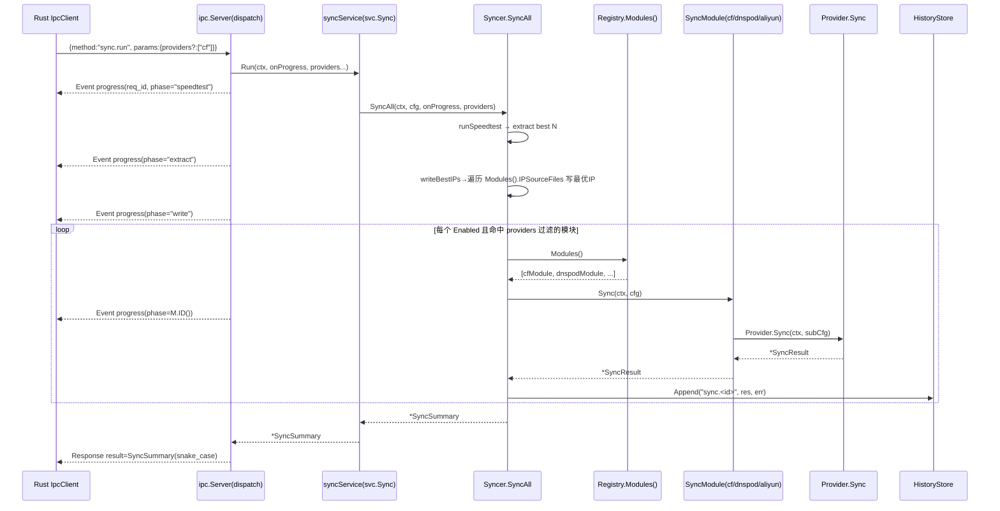
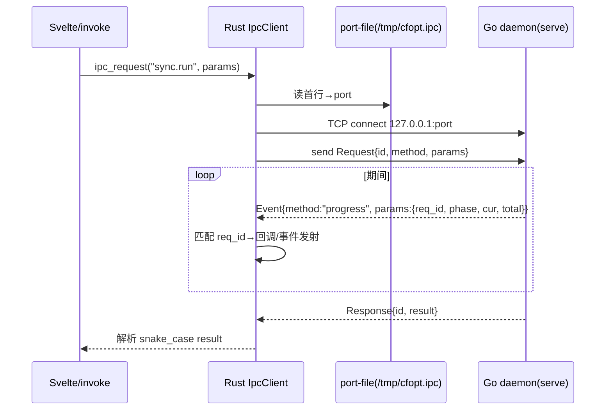
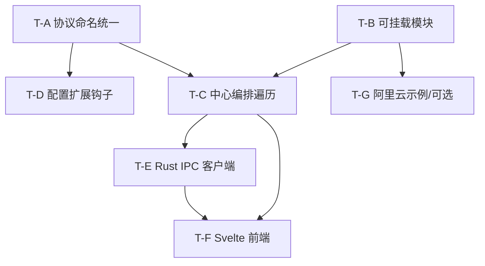

# cfopt-go 架构演进设计文档（协议统一 + 可挂载 DNS 模块 + GUI 对等）

> 作者：软件架构师（高见远）　|　范围：T11 收尾 + 模块化架构演进 + T11-3/T11-4 设计
> 说明：本文所有签名均经 `Read` 真实代码核实（见 §0），非凭空设计。仅交付设计与任务分解，不含实现代码。

---

## 0. 代码核查结论（Read 后的关键发现）

| 项 | 现状（核实） | 与 PRD 描述差异 |
|---|---|---|
| `pkg/ipc/protocol.go` 的 `VersionInfo`/`DaemonStatus`/`ProgressEvent` | **已具备 snake_case 标签**（`version/commit/built_at`、`state`、`req_id/phase/cur/total/message`） | PRD 称"仍 PascalCase"，**不符**，可能为旧快照 |
| `config.Config` 顶部字段 | `Global/CFIP/CFDNS/DNSPod` **无 json tag → 序列化即 PascalCase** | 这是 `config.get` 返回给 Rust 端的**真正命名不一致点** |
| `config.*Config` 子结构 | 字段均已 snake_case（`root_dir`、`secret_id`、`isp_lines` …） | 一致 |
| `sync.SyncSummary` / `speedtest.SpeedResult` / `history.HistoryEntry` | 均已 snake_case | 一致 |
| `dns.DNSProvider` 接口 | `ListRecords/UpsertRecord/DeleteRecord` | 已有，但**不含 Sync** |
| `CloudflareProvider.Sync` / `DNSPodProvider.Sync` | 已存在，但签名分别为 `(ctx,*CFDNSConfig)` / `(ctx,*DNSPodConfig)`，**未进入接口** | `Syncer` 用 `map[string]dns.DNSProvider` + 类型断言绕过 |
| `Syncer.NewSyncer` | 仅被 `BuildSyncerFromConfig` 内部调用（私有） | 签名可安全变更 |
| `Syncer.SyncAll` 调用方 | `cmd/serve.go`、`cmd/sync.go`、`internal/scheduler/scheduler.go` 共 3 处 | 需兼容 |
| IPC 13 方法 | `ping/version/config.get/config.validate/config.save/sync.run/speedtest.run/history.list/daemon.install/uninstall/start/stop/status` | 与 PRD 一致 |

**结论**：需求 1 的"协议命名统一"实为 **`config.Config` 顶部 4 字段补 snake_case 标签** + 用契约测试锁死 `protocol.go` 现状；`protocol.go` 本身几乎无需改动。

---

## 1. 实现方案 + 框架选型

### 1.1 沿用现有技术栈（不引入重依赖）
- Go 侧：`cobra`（CLI）、`kardianos/service`（daemon）、`cenkalti/backoff`（重试）、`testify`（测试）——均已在 `go.mod`。
- 序列化：标准库 `encoding/json`（JSON-RPC 2.0 + JSON Lines 帧，沿用 `pkg/ipc` 现有实现）。
- Rust 侧：Tauri v2 自带 `tokio` + `tauri-plugin-shell`（sidecar）；仅需 `serde_json`（一般已随 Tauri 模板引入）。
- Svelte 侧：标准 SvelteKit / Vite，经 `tauri` JS API `invoke`。
- **无新增第三方重依赖**。

### 1.2 DNS 提供方注册机制：显式 `BuiltinModules` 列表（主） + `Registry.Register` 运行时挂载（辅）
| 方案 | 优点 | 缺点 | 结论 |
|---|---|---|---|
| `init()` 自注册 | 新 provider 无需改中心列表，自动发现 | 遍历顺序不确定（影响 progress 阶段顺序与历史可读性）、有 import 副作用、测试难复现、插件包 import 顺序隐式 | 不采用为主 |
| **显式 `BuiltinModules []SyncModule`** | 顺序确定、无副作用、可一眼看清"激活了哪些"、易禁用、易测试 | 加内置 provider 需追加一行 | **采用（默认）** |
| `Registry.Register(m)` 运行时挂载 | 支持外部/插件包动态接入，不改 `internal/dns` | 需调用方主动注册 | **保留为扩展点** |

> 取舍理由："以中心模块为主、挂载模块为辅"隐喻下，**中心（`internal/sync`）只依赖 `SyncModule` 接口与 `Registry`，完全不感知具体 DNS 商**。新增阿里云等只需：① 实现 `SyncModule`；② 在 `BuiltinModules` 追加一行（或外部包调用 `dns.RegisterModule`）；③ 提供一份配置子结构。中心 `SyncAll` 遍历逻辑零改动。

---

## 2. 文件列表（新增 / 修改，标注语言归属）

### Go 核心（沙箱可 `go build/test` 验证）
| 路径 | 操作 | 说明 |
|---|---|---|
| `internal/dns/registry.go` | **新增** | `SyncModule` 接口、`Registry`、`BuiltinModules`、`cfModule`/`dnspodModule` 适配器（薄封装，复用既有 `*.Sync`） |
| `internal/dns/registry_test.go` | **新增** | 注册/遍历/顺序/启用过滤单测 |
| `internal/sync/sync.go` | **修改** | `Syncer` 持 `*dns.Registry`；`SyncAll` 遍历 `Modules()` 替代硬编码 `syncCloudflare/syncDNSPod`；`SyncAll` 增 `providers ...string` 过滤；`onProgress` 改非变参；`BuildSyncerFromConfig` 注册 `BuiltinModules` |
| `internal/scheduler/scheduler.go` | **修改** | 2 处 `SyncAll(ctx,cfg)` → `SyncAll(ctx,cfg,nil)`（兼容签名） |
| `cmd/sync.go` | **修改** | 1 处 `SyncAll(ctx,cfg)` → `SyncAll(ctx,cfg,nil)` |
| `pkg/ipc/server.go` | **修改** | `SyncService.Run` 增 `providers ...string`；`handleSyncRun` 解析 `params.providers` 并透传 |
| `cmd/serve.go` | **修改** | `syncService.Run` 签名透传 `providers...` |
| `pkg/ipc/server_test.go` | **修改** | `fakeSyncService.Run` 签名同步（加 `providers ...string`） |
| `internal/config/model.go` | **修改** | `Config` 顶部字段加 snake_case 标签（`global/cf_ip/cf_dns/dnspod`）；**新增** `Modules map[string]json.RawMessage \`json:"modules,omitempty"\`` 扩展钩子 |
| `internal/config/loader.go` | **修改** | `loadDir` 增量读取 `modules.json` 进 `Config.Modules`（additive，不改 cf/dnspod） |
| `pkg/ipc/protocol.go` | **修改(注释)** | 顶部补 snake_case 契约注释；字段标签已合规，原则上不动 |
| `pkg/ipc/protocol_test.go` | **新增** | 断言 `VersionInfo/DaemonStatus/ProgressEvent` 序列化键名 = snake_case（锁定契约） |
| `internal/config/loader_test.go` | **修改/新增** | 断言 `config.get` 全量 snake_case（含 `Config` 顶部键） |
| `internal/sync/sync_registry_test.go` | **新增** | mock `SyncModule` 验证 `SyncAll` 遍历/过滤/历史/阶段计数 |

### Rust（沙箱无工具链，仅源码级审查）
| 路径 | 操作 | 说明 |
|---|---|---|
| `tauri/src/ipc.rs` | **新增** | `IpcClient`：读 port-file → TCP loopback → JSON-RPC 2.0 请求/响应；`progress` 事件按 `req_id` 关联回调；13 方法封装 + snake_case 结构镜像 |
| `tauri/src/lib.rs` | **修改** | 注册 `ipc` 模块与 Tauri command（供 Svelte `invoke`） |
| `tauri/Cargo.toml` | **修改** | 确认 `tokio`、`serde`、`serde_json`、`tauri-plugin-shell` 依赖 |

### Svelte（沙箱无工具链，仅源码级审查）
| 路径 | 操作 | 说明 |
|---|---|---|
| `src/lib/tauri.ts` | **新增** | `invokeIpc(method, params)` 封装 → Rust command |
| `src/lib/ipc-types.ts` | **新增** | TypeScript 镜像 13 方法入参/出参与 snake_case 结构 |
| `src/routes/+page.svelte`（Dashboard） | **新增** | 一键同步 + progress 进度条 |
| `src/routes/speedtest/+page.svelte` | **新增** | 测速结果与历史 |
| `src/routes/settings/+page.svelte` | **新增** | config.get/validate/save |
| `src/routes/history/+page.svelte` | **新增** | history.list |
| `src/routes/service/+page.svelte` | **新增** | daemon.install/uninstall/start/stop/status |
| `src/routes/about/+page.svelte` | **新增** | version + ping |
| `package.json` / `svelte.config.js` / `vite.config.ts` | **新增/修改** | SvelteKit + Tauri 集成 |

---

## 3. 数据结构与接口

### 3.1 `SyncModule` 接口 + `Registry`（新增 `internal/dns/registry.go`）

```go
// SyncModule 可挂载的 DNS 同步模块。internal/sync 中心编排只依赖此接口。
type SyncModule interface {
    ID() string                                   // "cf"/"dnspod"/"aliyun"，注册键/日志前缀/历史 action
    Enabled(cfg *config.Config) bool              // 是否启用（未启用→中心跳过，不计入阶段数）
    IPSourceFiles(cfg *config.Config) []string    // 本模块消费的 IP 源文件（中心在 sync 前把最优 IP 写入）
    Sync(ctx context.Context, cfg *config.Config) (*SyncResult, error) // 完整智能同步（复用既有 Provider.Sync）
}

type Registry struct {
    mu      sync.RWMutex
    modules map[string]SyncModule
    order   []string
}
func NewRegistry() *Registry
func (r *Registry) Register(m SyncModule)
func (r *Registry) RegisterAll(ms []SyncModule)
func (r *Registry) Modules() []SyncModule   // 按注册顺序
func (r *Registry) Get(id string) (SyncModule, bool)

// 内置模块（显式、确定性顺序）。新增内置 provider：追加一行即可。
var BuiltinModules = []SyncModule{ cfModule{}, dnspodModule{} }
```

**`cfModule` / `dnspodModule` 适配器（薄封装，零逻辑改动）**
- `cfModule.Sync` → `NewCloudflareProvider(cfg.CFDNS).Sync(ctx, cfg.CFDNS)`
- `dnspodModule.Sync` → `NewDNSPodProvider(cfg.DNSPod).Sync(ctx, cfg.DNSPod)`
- `IPSourceFiles`：cf 返回 `[cfg.CFDNS.IPSource.FilePath]`；dnspod 按 `mode` 返回 `IPFilePath` 或各 `ISP` 线路文件（复用既有 `firstFile`/`firstIPFile` 辅助）。

### 3.2 既有类型（保持不变，确保测试不退化）
| 类型 | 签名 | 状态 |
|---|---|---|
| `dns.DNSProvider` | `ListRecords/UpsertRecord/DeleteRecord` | 不变 |
| `CloudflareProvider.Sync` | `Sync(ctx, *config.CFDNSConfig) (*SyncResult, error)` | **不变**（cloudflare_test/dnspod_test 不退化） |
| `DNSPodProvider.Sync` | `Sync(ctx, *config.DNSPodConfig) (*SyncResult, error)` | **不变** |
| `sync.SyncSummary` | `best_ip_count/updated/created/deleted/errors` | 不变 |
| `dns.SyncResult` | `updated/created/deleted/errors` | 不变 |

### 3.3 Config 扩展（注册即接入，不改中心）
- **cf/dnspod 完全保留**：仍走 `cf-dns.json`/`dnspod.json` 与 `Config.CFDNS`/`Config.DNSPod`，`loadDir/applyDefaults/validateConfigSchema/Save` 逻辑零改动。
- **新增 provider 钩子（additive）**：`Config` 增加 `Modules map[string]json.RawMessage \`json:"modules,omitempty"\``；`loadDir` 增量读取 `modules.json` 填充之（一行新增，不触碰 cf/dnspod 分支）。
- 新 provider 自管配置：其 `SyncModule.Sync` 从 `cfg.Modules["aliyun"]` 解析自有配置；自有校验可在模块内实现（config 包**不可反向 import dns**，故校验下沉到模块，符合既有依赖方向）。

### 3.4 IPC `SyncService` 接口（支持按 provider 过滤，保障 GUI 对等 CLI `dns cf`）
```go
type SyncService interface {
    Run(ctx context.Context, onProgress sync.ProgressFunc, providers ...string) (*sync.SyncSummary, error)
}
// providers 为空→全部启用模块；非空→仅指定 ID（须 Enabled）。向后兼容。
```

---

## 4. 程序调用流程（Mermaid 时序图）

> 完整图见 `docs/sequence-diagram.mermaid`；类图见 `docs/class-diagram.mermaid`。

### 4.1 中心编排遍历 provider（sync.run 端到端 + progress 穿插）


### 4.2 Rust 端连接发现 + 按 req_id 关联 progress


---

## 5. 任务列表（有序、依赖、验证分层）

> 验证分层：**Go 可验证** = 沙箱可 `go build/vet/test`；**Rust·Svelte 仅源码** = 沙箱无工具链，仅做源码级正确性审查。
> 注：本演进为多语言"扩展既有项目"，非 greenfield 脚手架，故任务数按语义拆分为 7 个（>元规则 5 上限），以团队主管"按实现顺序 + 依赖 + 验证分层"要求为准。

| ID | 任务 | 归属 | 源文件 | 依赖 | 优先级 | 验证 |
|---|---|---|---|---|---|---|
| **T-A** | 协议命名统一：`config.Config` 补 snake_case 标签 + `protocol.go` 契约测试锁死 | Go | `internal/config/model.go`、`pkg/ipc/protocol.go`、`pkg/ipc/protocol_test.go`（新） | — | P0 | Go 可验证 |
| **T-B** | 可挂载 DNS 模块：`SyncModule` 接口 + `Registry` + `BuiltinModules` + cf/dnspod 适配器 | Go | `internal/dns/registry.go`（新）、`internal/dns/registry_test.go`（新） | — | P0 | Go 可验证 |
| **T-C** | 中心编排遍历 provider：`Syncer` 持 `Registry`、`SyncAll` 遍历 + `providers` 过滤；IPC `sync.run` 透传 | Go | `internal/sync/sync.go`、`internal/scheduler/scheduler.go`、`cmd/sync.go`、`pkg/ipc/server.go`、`cmd/serve.go`、`pkg/ipc/server_test.go`、`internal/sync/sync_registry_test.go`（新） | T-B | P0 | Go 可验证 |
| **T-D** | 配置扩展钩子 `modules.json` + 命名回归测试 | Go | `internal/config/model.go`、`internal/config/loader.go`、`internal/config/loader_test.go` | T-A | P1 | Go 可验证 |
| **T-E** | T11-3 Rust IPC 客户端（13 方法 + port-file + progress 关联 + snake_case 镜像） | Rust | `tauri/src/ipc.rs`（新）、`tauri/src/lib.rs`、`tauri/Cargo.toml` | T-A, T-C | P1 | 仅源码 |
| **T-F** | T11-4 Svelte 前端（覆盖全部 13 方法，功能对等 CLI） | Svelte | `src/lib/tauri.ts`、`src/lib/ipc-types.ts`、`src/routes/**`、`package.json` | T-E | P2 | 仅源码 |
| **T-G** | （可选）阿里云示例 Provider 示范实现 | Go | `internal/dns/aliyun.go`（新）、`conf/aliyun.example.json`、`internal/dns/registry.go`(追加 BuiltinModules) | T-B | P3 | Go 可验证（若实现） |

**实现顺序建议**：T-A / T-B 可并行起步；T-C 依赖 T-B；T-D 依赖 T-A；T-E 依赖 A/C 契约；T-F 依赖 E；T-G 视 §9 确认。

---

## 6. 依赖包列表
- **Go**：无新增（沿用 `cobra`/`kardianos/service`/`cenkalti/backoff`/`testify`）。
- **Rust**：`tokio`、`serde`、`serde_json`、`tauri`、`tauri-plugin-shell`（Tauri v2 模板通常已含；仅确认）。
- **Svelte/前端**：`svelte`、`@sveltejs/kit`、`vite`、`@tauri-apps/api`（标准）。

---

## 7. 共享知识（跨文件约定）

### 7.1 snake_case 协议字段全表（Rust/Svelte 端务必对齐）
| 类型 | JSON 键 |
|---|---|
| `ipc.VersionInfo` | `version`, `commit`, `built_at` |
| `ipc.DaemonStatus` | `state` |
| `ipc.ProgressEvent` | `req_id`, `phase`, `cur`, `total`, `message` |
| `config.Config`（★本次新增） | `global`, `cf_ip`, `cf_dns`, `dnspod`, `modules` |
| `config.GlobalConfig` | `root_dir`,`log_dir`,`log_level`,`lock_dir`,`data_dir`,`cache_dir`,`bin_dir`,`schedule` |
| `config.CFIPConfig` | `enabled`,`cfst`,`speed_test`,`paths`,`cfst_path` |
| `config.CFDNSConfig` | `enabled`,`api`,`dns`,`ip_source`,`logging` |
| `config.DNSPodConfig` | `enabled`,`secret_id`,`secret_key`,`mode`,`isp_lines`,`domain`,`ttl`,`max_ips_per_record`,`sub_domain`,`sub_domain_unified`,`sub_domains`,`ip_file`,`log_dir`,`timeout`,`max_retries` |
| `sync.SyncSummary` | `best_ip_count`,`updated`,`created`,`deleted`,`errors` |
| `speedtest.SpeedResult` | `ip`,`sent`,`received`,`loss`,`latency`,`speed`,`colo` |
| `history.HistoryEntry` | `ts`,`action`,`detail`,`success` |
| JSON-RPC 标准键 | `jsonrpc`,`id`,`method`,`params`,`result`,`error` |

### 7.2 Provider 命名约定
- `SyncModule.ID()` 使用小写短标识：`cf` / `dnspod` / `aliyun`，作为注册键、历史 `action` 前缀（`sync.<id>`）、progress `phase` 值。
- 配置子键（新 provider）统一放在 `modules.<id>`（JSON）或独立 `<id>.json`；禁止在 `Config` 顶层新增 PascalCase 字段。

### 7.3 配置键约定
- 既有：`global.json`/`cf-ip.json`/`cf-dns.json`/`dnspod.json` 文件名与键不变。
- 新 provider：`modules.json` 顶层对象，键=provider ID，值=该 provider 自有配置（由各 `SyncModule` 自行解析校验）。

### 7.4 其他
- IPC 传输：TCP loopback + JSON Lines（每行一个 JSON，以 `\n` 结尾）；`sync.run` 期间在最终 response 前穿插 `progress` 通知（按 `req_id` 关联）。
- 进度阶段顺序：`speedtest` → `extract` → `write` → 各模块 `ID()`（按 `BuiltinModules` 顺序）→ 每个阶段 `cur` 递增，总数为 `3 + 启用模块数`。

---

## 8. 功能对等矩阵（CLI ↔ IPC ↔ GUI）

> 13 个 IPC 方法：`ping, version, config.get, config.validate, config.save, sync.run, speedtest.run, history.list, daemon.install, daemon.uninstall, daemon.start, daemon.stop, daemon.status`

| 能力 | CLI 命令 | IPC 方法 | GUI 操作入口 | 对等性 |
|---|---|---|---|---|
| 启动 daemon/IPC | `cfopt serve --ipc-port-file` | （server 本身） | 应用启动拉起 Go sidecar (`serve`) | GUI 隐式等价 ✓ |
| 心跳/连通 | — | `ping` | 连接状态指示灯 | GUI 独有监控 ✓ |
| 版本 | `cfopt version` | `version` | 关于页 | 双向 ✓ |
| 配置读取/生成 | `cfopt config init` / `config validate` | `config.get` | 设置页加载 | `init` 由 GUI `save` 替代（可接受） |
| 配置校验 | `cfopt config validate` | `config.validate` | 保存前校验 | 双向 ✓ |
| 配置保存 | （编辑文件） | `config.save` | 设置页保存 | 双向 ✓ |
| 单 DNS 商同步 | `cfopt dns cf` / `cfopt dns dnspod` | `sync.run` `{providers:["cf"\|"dnspod"]}` | 高级→仅同步 CF / 仅同步 DNSPod | **经 `providers` 过滤实现对等** ✓ |
| 一键全同步 | `cfopt sync` | `sync.run`（默认全量） | 主页「一键同步」 | 双向 ✓ |
| 测速 | `cfopt speedtest [--output]` | `speedtest.run` | 测速页 | CLI 额外写 `.iplist`；GUI 可在客户端写或 IPC 端补写（见 §9） |
| 历史 | （日志文件） | `history.list` | 历史页 | 双向 ✓ |
| 服务注册 | `cfopt schedule install` | `daemon.install` | 服务管理→安装 | 双向 ✓ |
| 服务注销 | `cfopt schedule uninstall` | `daemon.uninstall` | 服务管理→卸载 | 双向 ✓ |
| 服务启动 | `cfopt schedule start` | `daemon.start` | 服务管理→启动 | 双向 ✓ |
| 服务停止 | `cfopt schedule stop` | `daemon.stop` | 服务管理→停止 | 双向 ✓ |
| 服务状态 | — | `daemon.status` | 服务管理→状态 | GUI 独有监控 ✓ |
| 前台调度 | `cfopt schedule run [--once]` | （daemon 前台，GUI 不暴露） | — | GUI 用系统服务+sidecar 替代前台 `run` |

**结论**：CLI 的每条命令/子命令均有对应 IPC 方法或 GUI 入口；GUI 经 `sync.run {providers:[...]}` 可精确复现 CLI 的 `dns cf`/`dns dnspod` 细分；CLI 无直接 `daemon.status`/`ping` 等价（GUI 监控增强，不削弱 CLI）。**终端能做的 GUI 都能做，反之亦然**（仅 `config init`/`wizard` 为 TTY/文件便捷工具，GUI 以 `save` 覆盖其"生成配置"语义）。

---

## 9. 待明确事项（Unclear / 需主管拍板）

1. **`config.Config` 命名**：PRD 称 `protocol.go` 仍为 PascalCase，但实测已 snake_case；真正的 PascalCase 缺口在 `config.Config` 顶部字段。**已按"补 `config.Config` 标签"设计**，请确认此取舍（不影响 `protocol.go` 字段）。
2. **阿里云示例 Provider（T-G）本轮是否真写一份示范实现？** 还是只搭框架（`SyncModule`+`Registry`+`modules.json` 钩子），留作后续按文档自行扩展？建议本轮**先搭框架+契约测试**，阿里云示例作为可选 T-G，避免引入未经验证的外部 API 调用。
3. **`sync.run` 的 `providers` 过滤参数**：为对等于 CLI `dns cf`/`dns dnspod`，建议在 `SyncService.Run` 增加 `providers ...string`（向后兼容，省略即全量）。是否接受此轻微协议扩展（仍在 13 方法边界内）？
4. **`speedtest.run` 写文件**：CLI `speedtest` 额外生成 `.iplist`，IPC 版仅返回结果。是否需在 IPC 端补写文件（保持与 CLI 完全一致），还是由 GUI 客户端自行落盘？倾向 IPC 端补写（与 `sync.run` 内部 `writeBestIPs` 一致）。
5. **新 provider 配置校验位置**：因 `config` 包不可 import `dns`（既有方向），新 provider 配置校验下沉到 `SyncModule`（模块内 `Validate` 或 `Sync` 内校验）。是否接受该职责划分？
6. **Tauri 版本**：Rust 设计默认按 Tauri v2（`tauri-plugin-shell` 拉起 sidecar）。若实际为 v1，端口发现与 sidecar 启动 API 不同，需同步调整。请确认 Tauri 大版本。

---

## 附录：依赖关系图（Mermaid）

