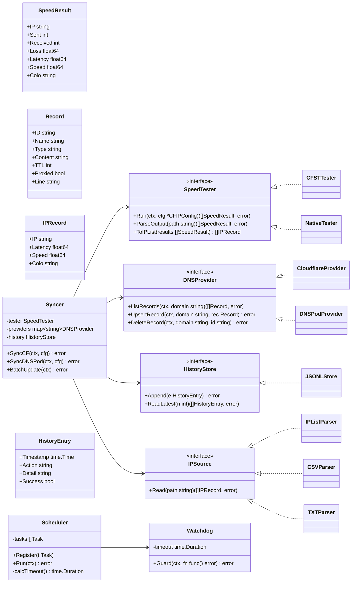
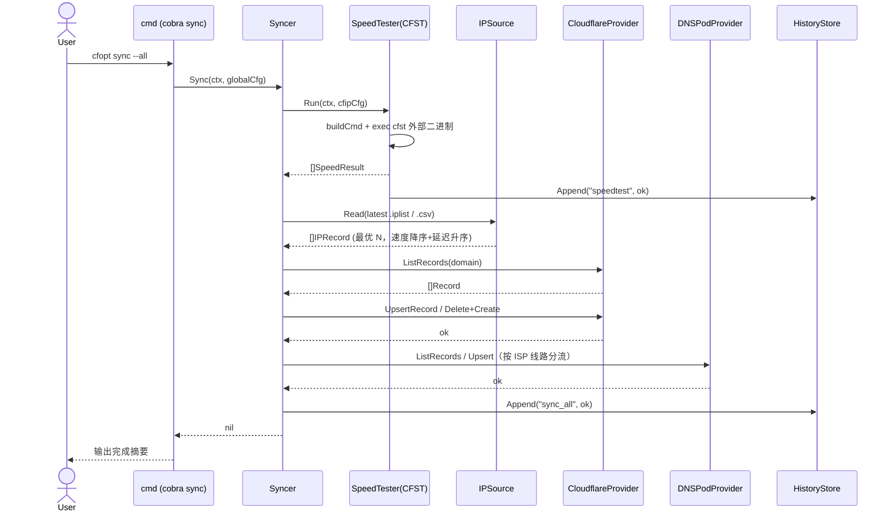
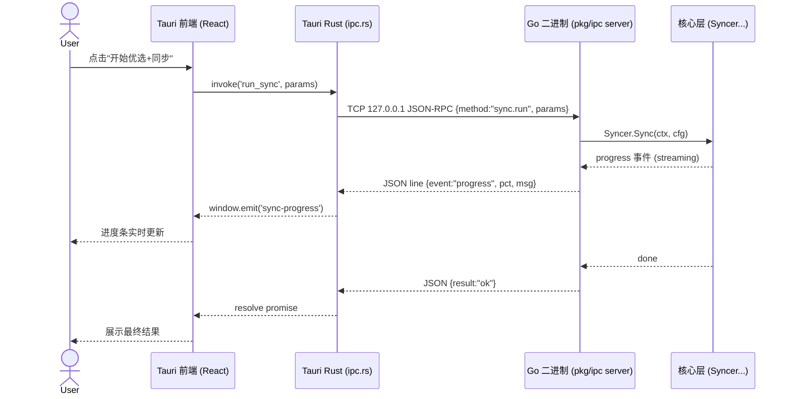

# cfopt 使用 Go 重新底层设计方案

> 目标：将现有纯 Bash 工具集 `cfopt` 用 Go 重写，满足
> 1. 多端适配 **Linux / Windows / macOS** 并支持交叉编译；
> 2. 可经 **Tauri** 等方案包装 GUI；
> 3. 提供 **cmd（命令行）** 与 **GUI** 两种操控方式，二者共用同一套核心业务逻辑。

---

## 0. 背景与现状

`cfopt` 现状为纯 Bash Shell 套件，通过调用外部二进制（`cfst` 测速、`curl`、`jq`、`flock`）完成：优选 Cloudflare 边缘节点 IP → 将最优 IP 同步写入 Cloudflare DNS / DNSPod 解析记录 → 由调度器定时编排整条链路。

### 现有架构痛点（重设计动因）
1. **强外部依赖**：`cfst`/`jq`/`curl` 分发与版本管理复杂。
2. **Bash 跨平台脆弱**：`stat`/`tac`/`flock` 在 Linux/macOS/Windows 行为差异大，Windows 几乎无法原生运行。
3. **并发控制复杂**：`flock` + `mkdir` fallback + `setsid` 看门狗。
4. **交互逻辑分散**：菜单/向导散落多处。
5. **无内置测试**：回归困难。
6. **难以包装 GUI**：强依赖 shell 子进程 + 外部二进制，业务逻辑无法直接复用做桌面端。

---

## 1. 整体架构（三层分离）

```
┌─────────────────────────────────────────────────────────────┐
│  GUI 集成层（tauri/）                                          │
│  Tauri(Rust) 仅做 UI + IPC 桥接，spawn Go 二进制并通信          │
└───────────────┬─────────────────────────────────────────────┘
                │ JSON-RPC over TCP loopback / stdio
┌───────────────┴─────────────────────────────────────────────┐
│  CLI 层（cmd/，cobra 子命令）                                   │
│  speedtest / dns cf / dns dnspod / sync / schedule / config   │
└───────────────┬─────────────────────────────────────────────┘
                │ 直接调用（同进程）
┌───────────────┴─────────────────────────────────────────────┐
│  核心领域层（internal/，纯 Go package，零 UI 依赖）              │
│  config / common / speedtest / dns / ipsource / sync /        │
│  scheduler / history                                          │
└─────────────────────────────────────────────────────────────┘
```

**关键决策**：核心领域层（`internal/` 下所有包）必须是**纯 Go、不 import 任何 UI/CLI/GUI 框架**的 package。cmd 与 GUI 都只调用这些 package，从而天然实现"一套业务逻辑，两种操控方式"。

---

## 2. 外部依赖替换策略

| 原 Bash 依赖 | Go 替代方案 | 说明 |
|---|---|---|
| `curl` | `net/http`（标准库） | 原生 HTTP 客户端，连接复用 |
| `jq` | `encoding/json`（标准库） | 配置解析、响应反序列化 |
| `flock` | `internal/common/fslock.go` 原子目录锁（`os.Mkdir`）+ 可选 `golang.org/x/sys` Flock | 跨平台无 CGO，Windows 亦可运行 |
| `stat -f/-c` | `os.Stat` / `os.ReadDir` | 原生跨平台 |
| `tac / tail -r` | Go 切片倒序遍历 | 原生跨平台 |
| `cfst`（测速二进制） | 保留为外部 sidecar，或 `internal/speedtest/native.go` 自研 | 通过 `assets/cfst/` 按平台分发 |

---

## 3. Tauri 集成方式（推荐方案）

**推荐：Go 编译为独立二进制 → Tauri 以 sidecar 方式拉起 → 本地 IPC 通信。**

- Go 端提供 `pkg/ipc` 模块，实现一个轻量 **JSON-RPC 服务**，监听 `127.0.0.1:<port>`（TCP 回环，跨平台最稳；备选 Unix socket / 命名管道）。协议采用 **JSON Lines（换行分隔 JSON）**，支持请求-响应 + 服务端主动 `progress` 事件流（用于进度条）。
- Tauri 端在 `tauri.conf.json` 的 `bundle.externalBin` 声明各平台 Go 二进制；Rust 侧 `ipc.rs` 通过 `tauri::api::process` 拉起 Go 二进制，将前端 `invoke()` 请求转发为 JSON-RPC，并把 Go 推送的 `progress` 事件用 `Window::emit` 转发给前端。
- **Rust 侧零业务逻辑**：只做 UI 渲染、参数校验透传、IPC 桥接。所有优选/测速/DNS 同步均在 Go 端完成。
- **备选 wails**：Go 原生 webview 方案，免 Rust，单语言栈；缺点是打包体积与系统 webview 耦合，且团队若已熟悉 Tauri/Rust 生态则 Tauri 更灵活。二者二选一（见 §待明确事项）。

---

## 4. cmd 模式（cobra 子命令树）

```
cfopt
 ├─ speedtest            # 单次测速，生成 .iplist / .csv
 ├─ dns
 │   ├─ cf               # Cloudflare 记录同步
 │   └─ dnspod           # DNSPod 记录同步（含多运营商分流）
 ├─ sync                 # 一键：测速→提取最优 IP→同步 CF/DNSPod→批量更新
 ├─ schedule             # 启动调度器（带看门狗超时保护）
 ├─ config               # init（生成模板）/ wizard（交互式向导）/ validate
 └─ version
```

---

## 5. 文件列表及目录树

```
cfopt-go/
├── go.mod                       # Go module 定义（module cfopt，go 1.22+）
├── go.sum
├── main.go                      # 程序入口，调用 cmd.Execute()
├── cmd/                         # CLI 层（cobra）
│   ├── root.go                  # 根命令、全局 flag（--config-dir, --log-level）
│   ├── speedtest.go
│   ├── dns.go                   # dns 父命令
│   ├── dns_cf.go
│   ├── dns_dnspod.go
│   ├── sync.go                  # 主链路
│   ├── schedule.go
│   ├── config.go                # init/wizard/validate
│   └── version.go               # 打印注入的版本信息
├── internal/                    # 核心领域层（纯 Go，零 UI 依赖）
│   ├── common/
│   │   ├── log.go               # slog 初始化与级别封装
│   │   ├── fslock.go            # 跨平台进程锁（原子目录 + x/sys 可选）
│   │   ├── ip.go                # validate_ip（拒绝 0.0.0.0/255.255.255.255）
│   │   ├── file.go              # 文件读取/查找最新/倒序读/stat 封装
│   │   └── errors.go            # 统一错误类型与 wrap 约定
│   ├── config/
│   │   ├── model.go             # CFIPConfig/CFDNSConfig/DNSPodConfig/GlobalConfig
│   │   ├── loader.go            # 加载 + validate_config_schema
│   │   └── template.go          # 默认模板生成
│   ├── speedtest/
│   │   ├── tester.go            # SpeedTester 接口
│   │   ├── cfst.go              # 外部 cfst 二进制封装
│   │   ├── native.go            # （可选）Go 原生测速
│   │   ├── model.go             # SpeedResult 结构
│   │   └── colo.go              # convert_colo_to_name（Colo→中文名）
│   ├── dns/
│   │   ├── provider.go          # DNSProvider 接口
│   │   ├── model.go             # Record / RecordType
│   │   ├── http.go              # 共享 HTTP 客户端（重试 + 指数退避 429）
│   │   ├── cloudflare.go
│   │   └── dnspod.go            # 单线路/多运营商分流
│   ├── ipsource/
│   │   ├── source.go            # IPSource 接口 + 格式探测
│   │   ├── iplist.go            # .iplist 解析
│   │   ├── csv.go               # cfst .csv 解析
│   │   └── txt.go               # 纯 .txt 解析
│   ├── sync/
│   │   ├── sync.go              # Syncer 编排
│   │   └── extract.go           # extract_best_ips / 格式互转
│   ├── scheduler/
│   │   ├── scheduler.go         # 任务注册与编排（单/多线路两阶段）
│   │   └── watchdog.go          # 超时杀进程树（context + goroutine）
│   └── history/
│       └── store.go             # HistoryStore：jsonl 读写（带锁）
├── pkg/
│   └── ipc/                     # GUI 集成层依赖的 IPC 服务（Go 侧）
│       ├── server.go            # JSON-RPC over TCP loopback + progress 事件流
│       └── protocol.go          # Request/Response/Event 结构
├── conf/                        # 配置模板
│   ├── cf-ip.json.example
│   ├── cf-dns.json.example
│   ├── dnspod.json.example
│   └── global.json.example
├── assets/
│   └── cfst/                    # 按平台放置 cfst 二进制（占位）
│       ├── cfst-linux-amd64
│       ├── cfst-linux-arm64
│       ├── cfst-darwin-amd64
│       ├── cfst-darwin-arm64
│       ├── cfst-windows-amd64.exe
│       └── cfst-windows-arm64.exe
├── scripts/                     # 构建与版本
│   ├── build.sh                 # 交叉编译矩阵（CGO_ENABLED=0）
│   ├── build.ps1                # Windows 等价构建
│   └── version.sh               # 生成 version.txt（KEY=VERSION:SHA256）
├── version.txt
└── tauri/                       # Tauri companion（独立前端仓库）
    ├── package.json
    ├── src/                     # 前端源码
    └── src-tauri/
        ├── Cargo.toml
        ├── tauri.conf.json      # externalBin 声明 Go 二进制
        ├── build.rs
        └── src/
            ├── main.rs
            └── ipc.rs           # 桥接：前端 invoke ↔ Go JSON-RPC
```

---

## 6. 数据结构与接口

### 6.1 类图



### 6.2 关键代码草图

```go
// internal/speedtest/tester.go
type SpeedResult struct {
    IP       string  `json:"ip"`
    Sent     int     `json:"sent"`
    Received int     `json:"received"`
    Loss     float64 `json:"loss"`
    Latency  float64 `json:"latency"`
    Speed    float64 `json:"speed"`
    Colo     string  `json:"colo"`
}
type SpeedTester interface {
    Run(ctx context.Context, cfg *config.CFIPConfig) ([]SpeedResult, error)
    ParseOutput(path string) ([]SpeedResult, error)
    ToIPList(results []SpeedResult) []ipsource.IPRecord
}

// internal/dns/provider.go
type Record struct {
    ID      string `json:"id"`
    Name    string `json:"name"`
    Type    string `json:"type"`
    Content string `json:"content"`
    TTL     int    `json:"ttl"`
    Proxied bool   `json:"proxied"`
    Line    string `json:"line,omitempty"`
}
type DNSProvider interface {
    ListRecords(ctx context.Context, domain string) ([]Record, error)
    UpsertRecord(ctx context.Context, domain string, rec Record) error
    DeleteRecord(ctx context.Context, domain string, id string) error
}

// internal/ipsource/source.go
type IPRecord struct {
    IP      string  `json:"ip"`
    Latency float64 `json:"latency"`
    Speed   float64 `json:"speed"`
    Colo    string  `json:"colo"`
}
type IPSource interface { Read(path string) ([]IPRecord, error) }

// internal/config/model.go
type CFIPConfig struct {
    Enabled    bool     `json:"enabled"`
    IPFile     string   `json:"ip_file"`
    Threads    int      `json:"threads"`
    MaxRetry   int      `json:"max_retry"`
    Timeout    int      `json:"timeout"`
    ColoFilter []string `json:"colo_filter"`
}
type CFDNSConfig struct {
    APIToken string   `json:"api_token"`
    ZoneID   string   `json:"zone_id"`
    Domains  []string `json:"domains"`
}
type DNSPodConfig struct {
    SecretID  string             `json:"secret_id"`
    SecretKey string             `json:"secret_key"`
    Mode      string             `json:"mode"` // single | isp_lines
    ISP       map[string]ISPConf `json:"isp_lines"`
}
type ISPConf struct {
    Domains  []string `json:"domains"`
    IPSource struct {
        Files map[string]string `json:"files"`
    } `json:"ip_source"`
}
type GlobalConfig struct {
    LogDir   string `json:"log_dir"`
    LogLevel string `json:"log_level"`
    LockDir  string `json:"lock_dir"`
}

// internal/scheduler/watchdog.go
type Watchdog struct{ timeout time.Duration }
func (w *Watchdog) Guard(ctx context.Context, fn func() error) error {
    ctx, cancel := context.WithTimeout(ctx, w.timeout)
    defer cancel()
    done := make(chan error, 1)
    go func() { done <- fn() }()
    select {
    case err := <-done:
        return err
    case <-ctx.Done():
        return fmt.Errorf("watchdog: 任务超时 %s: %w", w.timeout, ctx.Err())
    }
}

// internal/history/store.go
type HistoryEntry struct {
    Timestamp time.Time `json:"ts"`
    Action    string    `json:"action"`
    Detail    string    `json:"detail"`
    Success   bool      `json:"success"`
}
type HistoryStore interface {
    Append(e HistoryEntry) error
    ReadLatest(n int) ([]HistoryEntry, error)
}
```

---

## 7. 调用流程时序图

### 7.1 cmd 模式：一次「测速 → 同步 → 批量更新 DNS」主链路



### 7.2 GUI 模式：Tauri ↔ Go IPC 调用链



---

## 8. 任务分解（有序、含依赖）

| 任务 | 名称 | 主要产出文件 | 依赖 | 优先级 |
|---|---|---|---|---|
| **T1** | 初始化 module + 配置模型 | `go.mod`, `main.go`, `internal/config/model.go`, `loader.go`, `template.go`, `conf/*.example` | — | P0 |
| **T2** | common 工具包 | `internal/common/{log,fslock,ip,file,errors}.go` | T1 | P0 |
| **T3** | SpeedTester 封装 | `internal/speedtest/{tester,cfst,model,colo}.go` | T1,T2 | P0 |
| **T4** | DNSProvider 抽象 + Cloudflare 实现 | `internal/dns/{provider,model,http,cloudflare}.go` | T1,T2 | P0 |
| **T5** | DNSPod 实现（含多运营商分流） | `internal/dns/dnspod.go` | T4 | P1 |
| **T6** | IPSource 多格式解析 | `internal/ipsource/{source,iplist,csv,txt}.go` | T2 | P1 |
| **T7** | ip-sync 编排 | `internal/sync/{sync,extract}.go` | T3,T4,T5,T6 | P1 |
| **T8** | Scheduler / Watchdog | `internal/scheduler/{scheduler,watchdog}.go` | T2,T7 | P1 |
| **T9** | HistoryStore | `internal/history/store.go` | T2 | P2 |
| **T10** | cmd / Cobra 子命令 | `cmd/*.go` | T7,T8,T9 | P0 |
| **T11** | Tauri companion + IPC | `pkg/ipc/{server,protocol}.go`, `tauri/src-tauri/src/ipc.rs` | T7,T10 | P1 |
| **T12** | 交叉编译脚本 | `scripts/{build.sh,build.ps1,version.sh}`, `version.txt`, `assets/cfst/*` | T10 | P2 |
| **T13** | 单元测试 | 各包 `*_test.go` | T3~T9 | P2 |

> 依赖说明：T1 是地基；T2 横切工具；T3/T4 并行起步；T5 依赖 T4；T6 独立；T7 汇总 T3/T4/T5/T6；T8 依赖 T7；T9 可并行；T10 串起全部；T11 在 T7/T10 之上；T12 在 CLI 成型后；T13 覆盖核心算法。

---

## 9. 依赖包列表

| 依赖 | 用途 |
|---|---|
| `github.com/spf13/cobra` | CLI 子命令树 |
| `github.com/stretchr/testify` | 单元测试 |
| `golang.org/x/sys` | （可选）Unix/Windows 真文件锁；纯原子目录锁则可不引入 |
| `github.com/cenkalti/backoff/v4` | HTTP 指数退避（429 重试） |
| `log/slog`（标准库） | 统一结构化日志 |
| `github.com/fsnotify/fsnotify` | （可选）配置热加载 |
| `net/http` + `encoding/json`（标准库） | 替代 `curl` / `jq` |
| `context` + `time`（标准库） | Watchdog 超时控制 |

> 原则：尽量用标准库；测速可选保留 `cfst` 外部二进制；GUI 桥接用 `pkg/ipc` 自研轻协议，不引入重型框架。

---

## 10. 共享约定（跨文件）

- **错误封装**：`internal/common/errors.go` 定义统一错误类型，跨包错误用 `fmt.Errorf("cfopt: %w", err)` wrap；不吞错、不裸 panic。
- **日志统一**：全工程只用 `log/slog`，经 `common/log.go` 初始化（级别来自 `GlobalConfig.LogLevel`）；业务包不直接 `fmt.Println`。
- **配置加载单例**：`config.Loader` 提供 `Load(dir)` 并 `sync.Once` 缓存，对应原 Bash 的 `CF_IP_CFG_LOADED`。
- **跨平台文件锁**：`internal/common/fslock.go` 暴露 `Acquire(name) (ReleaseFunc, error)`；默认原子目录锁（无 CGO），残留锁按 30min 清理。
- **IP 校验复用**：`common/ip.go` 的 `ValidateIP(s) error` 为唯一入口，拒绝 `0.0.0.0`/`255.255.255.255`，测速与 DNS 同步均调用。
- **版本注入**：`version.txt`（`VERSION:<ver>`，如 `VERSION:dev`）由 `scripts/version.sh` 生成；构建时 `-ldflags "-X cfopt/cmd.Version=..."` 注入 `cmd/version.go` 的 `Version` 变量，`cmd` 与 `pkg/ipc` 共用（与 `scripts/build.sh` 一致）。
- **数据格式**：`.iplist`=`IP|延迟|速度|地区码`；`.csv`=`IP,已发送,已接收,丢包率,平均延迟,下载速度,地区码`；`history.jsonl` 写时加锁。
- **多端构建**：`CGO_ENABLED=0` 静态二进制；交叉编译矩阵见 T12。

---

## 11. 已确认决策（用户拍板，2026-07-16）

1. **测速实现路径**：✅ 继续用 `cfst` 外部 sidecar（放弃 `native.go` 原生重写，减少工作量）。`internal/speedtest/cfst.go` 封装。
2. **GUI 方案**：✅ **Tauri + Go sidecar**（Rust 仅做 UI + IPC 桥接）。理由见 §1/§3 与交付说明。
3. **前端技术栈**：✅ 轻量框架（推荐 Svelte；Vue 亦可），Tauri 前端保持最小依赖。
4. **调度形态**：✅ **常驻轻量 daemon** 负责定时任务；兼容 cron 唤醒 + 系统服务注册（Windows Service / systemd / launchd）。T8 据此扩展。
5. **cfst 二进制来源**：各平台二进制置于 `assets/cfst/`，运行时按 `GOOS/GOARCH` 选择；获取渠道与版本绑定由 `scripts/version.sh` 记录。
6. **配置/日志/锁目录**：✅ 沿用当前架构的默认位置约定（模块化）；重点投入 `internal/common` 公共框架，避免重复代码。
7. **代码落位**：✅ 重构的 Go 代码放在项目内独立文件夹 `cfopt-go/`，**不直接替换**现有 Bash 代码。

> 决策已锁定，T8/T11/T12 形态定型，进入实现阶段（按 T1→T13 推进）。
